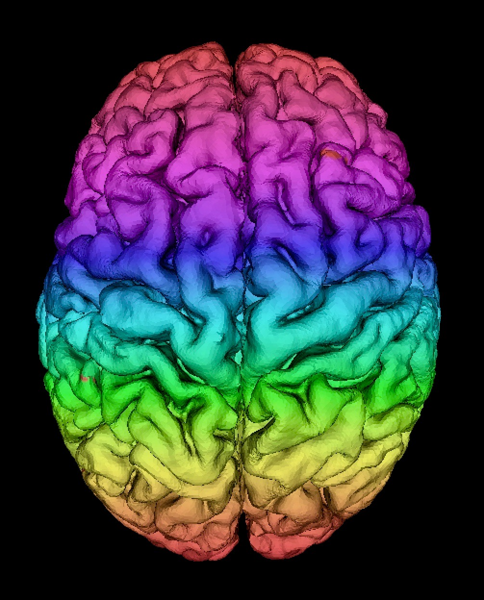

+++
title = "about me"
date = 2021-06-27T19:24:19-05:00
categories = ["me"]
description = "Legends say that the stache grows commensurately with my wisdom."
[schema]
 type = "note"
[[copyright]]
  owner = "Zach Stoebner"
  date = "2021"
  license = "cc-by-nd-4.0"
[[resources]]
  src = "image/profile.jpeg"
  name = "thumbnail"
+++

<figure>

<figcaption>Hi, I'm Zach!</figcaption>
</figure>

I leverage machine learning to solve challenging problems in neuroscience, computer vision, and autonomous systems. <strong>I'm an incoming ECE PhD student at UT Austin</strong> on a Cockrell Engineering Fellowship working with Prof. [Jon Tamir](https://users.ece.utexas.edu/~jtamir/) in the [Computational Sensing and Imaging Lab](https://users.ece.utexas.edu/~jtamir/csilab.html). I'm currently a graduate student researcher in [VISE MedICL](https://www.vanderbilt.edu/vise/visepeople/zachary-stoebner/) at [Vanderbilt University](https://www.vanderbilt.edu) advised by Prof. Ipek Oguz investigating applied ML for medical and neuroscientific data. Generally, I'm curious about [AI](/tags/ai)/[ML](/tags/ml) & [neuroscience](/tags/neuro), [intelligent systems](/tags/cps) & [robotics](/tags/robotics), and [optimization](/tags/opt) & [control](/tags/control). 

Check out my [projects](/projects/) to see what I'm working on, [notes](/notes/) to see what I'm thinking about, and [kū](/kus/) to see what I'm seeing!

[CV](/doc/CV.pdf)
[GitHub](https://github.com/zstoebs)
[LinkedIn](https://www.linkedin.com/in/zstoebs/)

<!--more-->

---

I graduated from Vandy in May 2021 with a B.S. in computer science and neuroscience, minoring in applied math. I expect to complete my M.S. in computer science, also at Vandy, in May 2022. I'm writing my thesis on a deep learning-based segmentation system for surgical endoscopy. 

I'm passionate about connecting with youth and the broader community on topics of science and engineering. During undergrad, I was a mentor in the [VUSE Design Studio](https://my.vanderbilt.edu/designstudio/) and served as the communications chair in my senior year. I was also a section leader & reviewer for the [Vanderbilt Undergraduate Research Journal](https://vurj.vanderbilt.edu) for natural sciences and then served as a graduate mentor. Currently, I'm serving as the community outreach chair for [Out in Engineering](https://anchorlink.vanderbilt.edu/organization/outinengineering). 

Over the past couple of years, I have had the privilege to assist with courses on discrete structures, operating systems, deep learning, AI, and currently ML projects. 

---

I enjoy heavy weights, friendship, [haiku & senryu](/kus/), [hendiadys](/notes/hendiadys), esports, kombucha, cucumber cocktails, and sunset runs. Occasionally, I take a good photo and write a [kū](/kus/) to pair with it. I especially like to take shameless photoshoots of my cats, [Amie and Chaussure](/kus/spring-summer-2021). 

I am a Lusophone > Hispanophone > Francophone. I self-studied Portuguese throughout high school, then I took a crucial gap year of emotional and linguistic growth in Lisbon, Portugal. 

My hometown is Austin, TX, and I hope one day I can live there again as a scientist guiding the future of tech. 

---

I'm always open to new opportunities, especially those that align with my interests. You can contact me at [+1(512)547-7486](tel:+15125477486) or zachary.a.stoebner@vanderbilt.edu.

<figure>
 
</figure>
