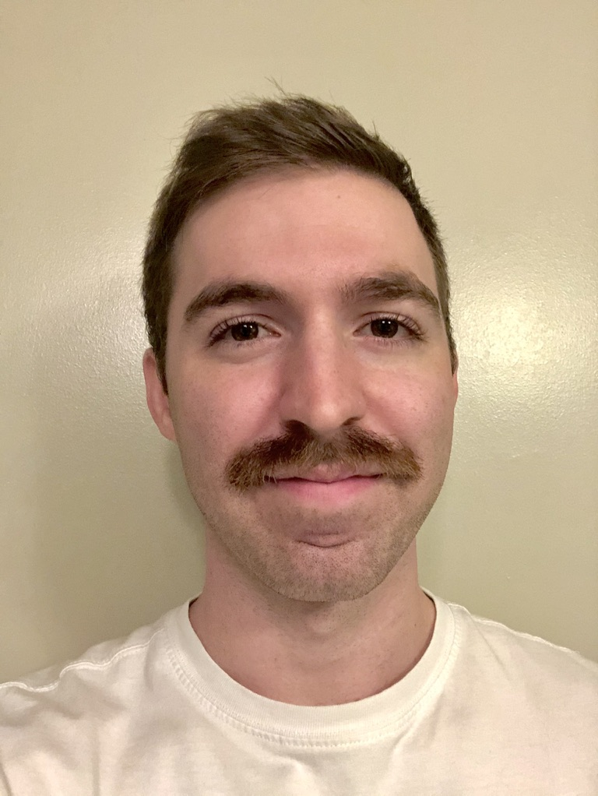

+++
title = "about me"
date = 2021-06-27T19:24:19-05:00
description = "Who even am I?"
draft = false
[schema]
  type = "AboutPage"
[[copyright]]
  owner = "Zach Stoebner"
  date = "2021"
  license = "cc-by-nd-4.0"
[[resources]]
  src = "images/profile.jpeg"
  name = "header thumbnail"
  title = "goofy profile pic"
+++

 

Hi, I'm Zach! I'm a grad student researcher at Vanderbilt University in Nashville, TN. I currently work in [VISE MedICL](https://www.vanderbilt.edu/vise/visepeople/zachary-stoebner/) applying ML to medical and neuroscientific data -- mainly brain MRI, endoscopic feeds, fMRI, and EEG. I'm also intersted in dimensionality reduction, control theory, optimization, and robotics. I am always open to new research opportunities, especially those that align with my interests.

Check out my projects to see what I'm working on!

---

I graduated from Vandy in May 2021 with a B.S. in computer science and neuroscience, with a minor in applied math. I expect to complete my masters in computer science from Vandy in May 2022.

---

Outside of work, I enjoy exercise, poetry, books, games, and friends.

---

You can contact me at zachary.a.stoebner@vanderbilt.edu.

[GitHub](https://github.com/zstoebs)
[LinkedIn](https://www.linkedin.com/in/zstoebs/)
