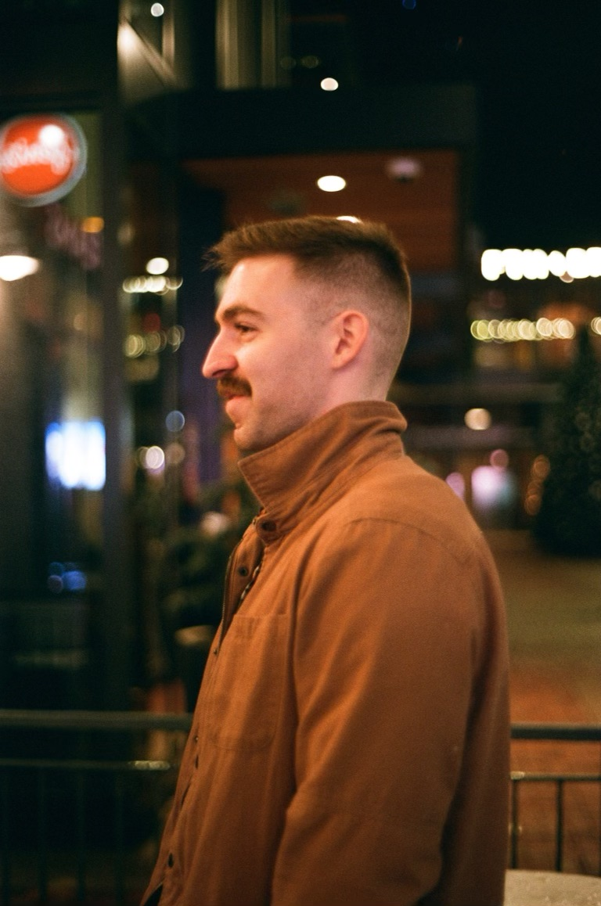

+++
title = "about me"
date = 2021-06-27T19:24:19-05:00
showmeta = false
categories = ["me"]
description = ""
summary = "Legends say that the stache grows commensurately with my wisdom."
[schema]
  type = "note"
[[copyright]]
  owner = "Zach Stoebner"
  date = "2021"
  license = "cc-by-nd-4.0"
[[resources]]
  src = "image/profile.jpeg"
  name = "thumbnail"
+++

<figure>

<figcaption>Hi, I'm Zach!</figcaption>
</figure>

I'm an [Electrical & Computer Engineering](https://www.ece.utexas.edu) PhD student at [UT Austin](https://www.utexas.edu) working with [Prof. Jon Tamir](https://users.ece.utexas.edu/~jtamir/) in the [Computational Sensing & Imaging Lab](https://users.ece.utexas.edu/~jtamir/csilab.html).

My research interests span **computational imaging** & **computer vision** and **machine learning** & **optimization**. Currently, I am working on provable learning methods for solving inverse problems in Fourier imaging systems with an emphasis on magnetic resonance imaging. Generally, I'm curious about [AI](/tags/ai)/[ML](/tags/ml) & [signal processing](/tags/sigproc), [optimization](/tags/opt) & [control](/tags/control), and [intelligent systems](/tags/cps) & [robotics](/tags/robotics).  

Check out my [notes](/notes/) to see what I'm thinking about and [kū](/kus/) to see what I'm seeing!

I'm always open to new opportunities and collaborations within my interests. You can contact me at <zstoebner@austin.utexas.edu>.

[CV](/doc/CV.pdf)
[GitHub](https://github.com/zstoebs)
[LinkedIn](https://www.linkedin.com/in/zstoebs/)
[Scholar](https://scholar.google.com/citations?authuser=2&user=uQ4eoukAAAAJ)

<!--more-->

---

I graduated from [Vanderbilt University](https://www.vanderbilt.edu) in 2021 with a B.S. in computer science and neuroscience, minoring in applied math, and then again in 2022 with my M.S. in computer science. I was a student researcher in [VISE MedICL](https://www.vanderbilt.edu/vise/visepeople/zachary-stoebner/) advised by [Prof. Ipek Oguz](https://engineering.vanderbilt.edu/bio/ipek-oguz) where I worked on computational neuroscience and deep learning methods for image processing. My awesome collaborators were [Dr. Nick Kavoussi](https://www.vumc.org/urology/person/nicholas-kavoussi-md) at VUMC and [David Lu](https://www.vanderbilt.edu/vise/visepeople/daiwei-david-lu/).  

---

I enjoy tennis, heavy weights, trail running, climbing, backpacking in the mountains, [kū & tanka poetry and photography](/kus/), and [hendiadys](/notes/hendiadys).  

I am an Anglophone > Lusophone > Hispanophone > Francophone.  

My hometown is Austin, TX. I was born in Abilene, TX.  
