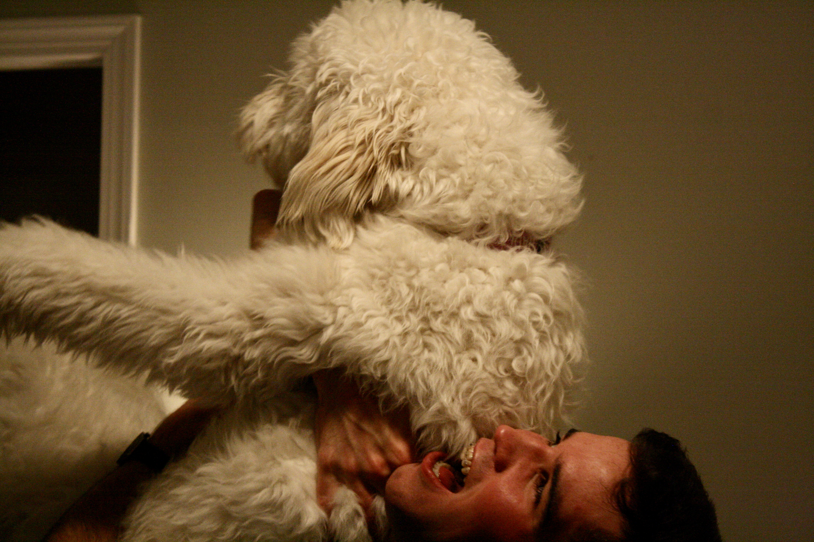
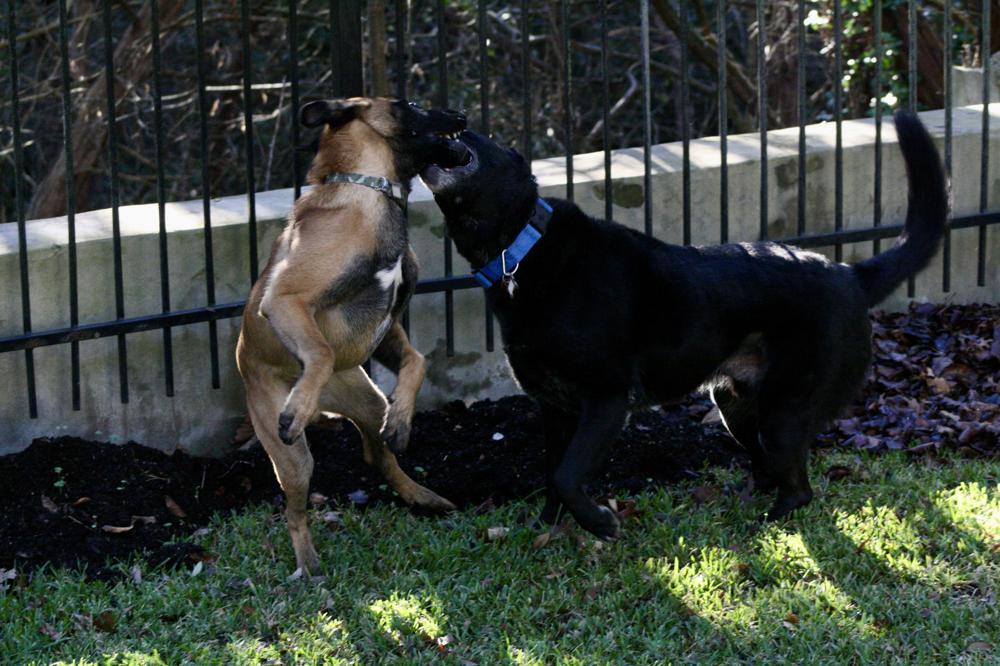

+++
title = "fall-winter 2018"
date = 2021-07-02T11:46:28-05:00
description = "haiku, senryu, and tanka from fall-winter 2018"
summary = "season of the dog"
categories = ["haiku","senryu","tanka"]
tags = ["fall","winter"]
draft = false
[schema]
  type = "ku"
[[copyright]]
  owner = "Zach Stoebner"
  date = "2021"
  license = "cc-by-nd-4.0"
[[resources]]
  src = "image/poop.JPG"
  name = "header thumbnail"
+++

# fall

to her  
autumn means outside  
ball is everything  

grey room  
fits dying leaves, not  
how he feels  

# winter

before happened  
two fraternal hounds --  
dry yard grass  
no order in time's quanta  
next does not exist  

