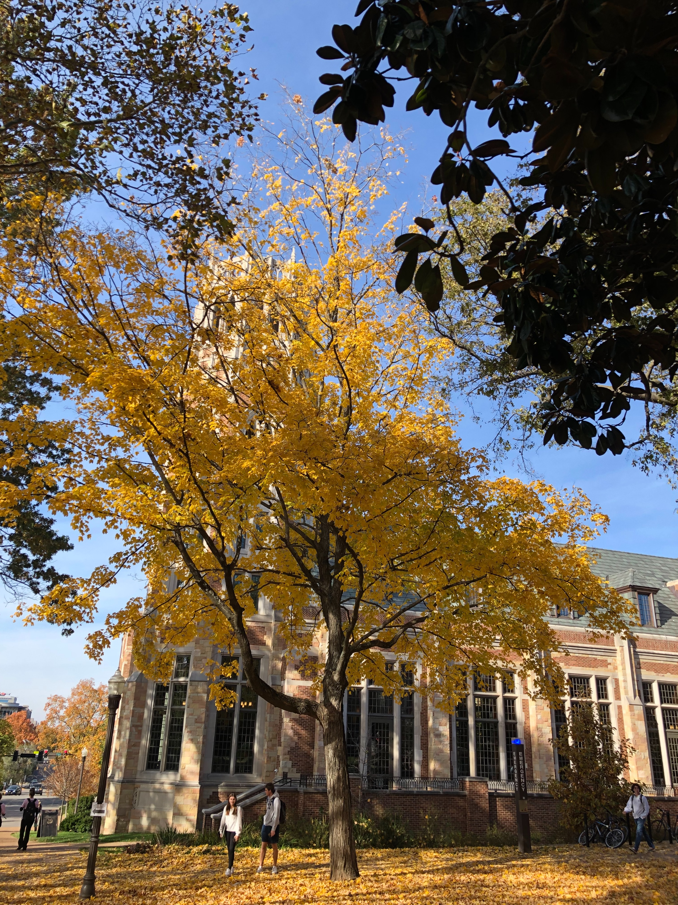
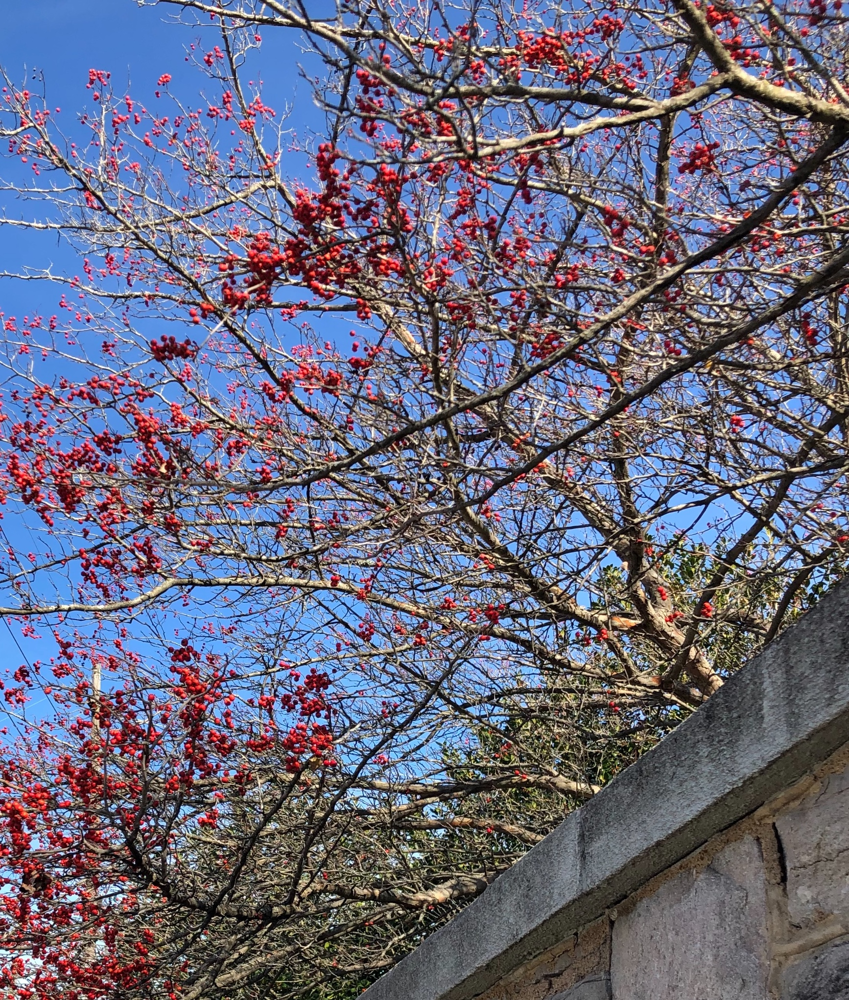

+++
title = "fall 2021"
date = 2022-02-23T12:17:56-06:00
description = "kū from fall 2021"
summary="breakup with Parker"
categories = ["haiku","senryu"]
tags = ["fall","winter"]
draft = false
[schema]
  type = "ku"
[[copyright]]
  owner = "Zach Stoebner"
  date = "2022"
  license = "cc-by-nd-4.0"
[[resources]]
  src = "image/grandad.JPG"
  name = "header thumbnail"
+++

# fall

numbing :: I feel nothing but feel the numbness  

nine friends  
bathing in the pool  
of fallen oak leaves  

flock of birds  
leaves in the wind  
shift in unison  

seventieth page  
the answer to my problem  
on an oak leaf  

hard stare  
my mind-body is zen  
autumn blows in  

different pretty  
shaped pink geranium  
in autumn twilight  

yellow maple  
blesses us all  
with autumn  

broken toe  
on my 24th birthday  
Autumn’s rebirth  

sometimes  
   -- it all just comes  
together  

in one house, for moving beings  
    still autumn breeze  
    
my beginning ahead, gaze up my journey’s trail, behind my ends  

cornucopia :  
i love that word  
so much  

gradient  
from the autumn maple  
cone's tip  

small red fruit  
infect leafless branches  
of a Yule tree  

