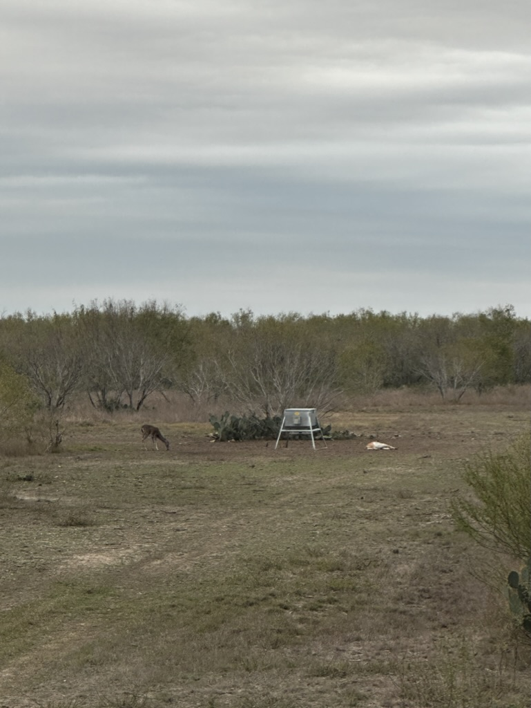
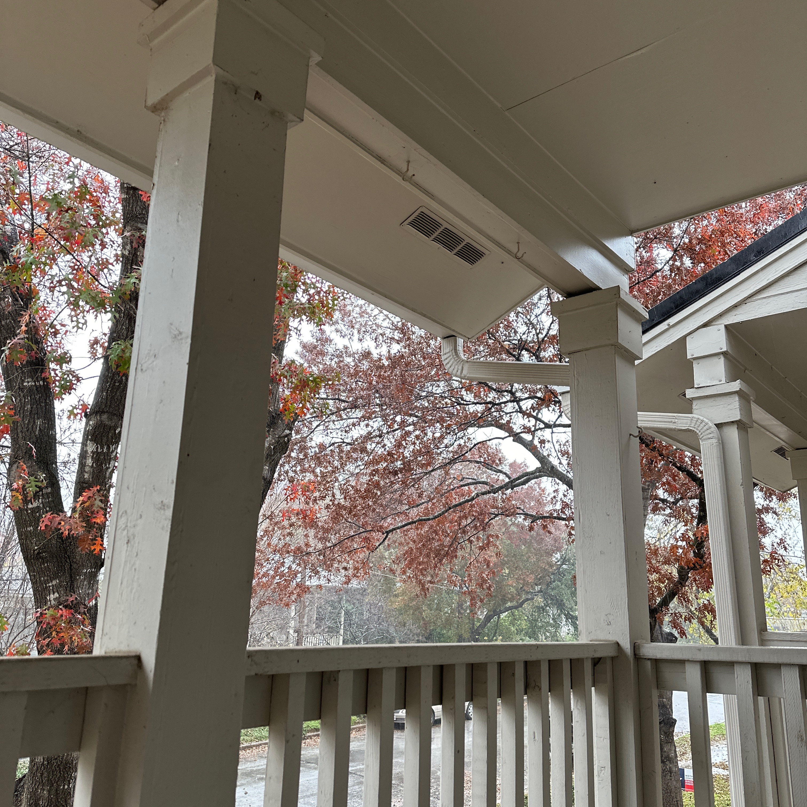
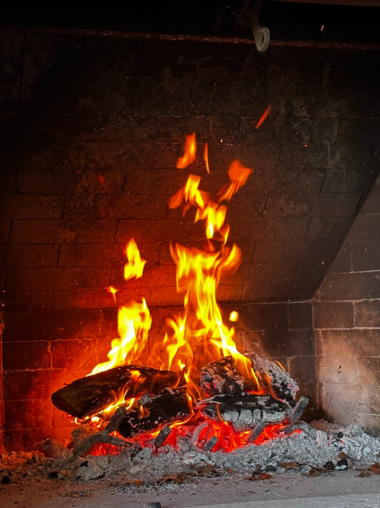

+++
title = "fall-winter 2023-2024"
date = 2025-05-11T14:25:22-05:00
showmeta = true
description = "kū and tanka from fall-winter 2023-2024"
summary = "revving up PhD part 2"
categories = ["haiku","senryu"]
tags = ["fall","winter"]
draft = false
[schema]
  type = "ku"
[[copyright]]
  owner = "Zach Stoebner"
  date = "2025"
  license = "cc-by-nd-4.0"
+++

## fall

stillness in cool depths  
of subtle sweet hibiscus :  
2 am meditation  

blind on cool morning  
whitetail doe grazes by  
aoudad cleanly slain  

## winter

rain patterns -  
Martian symphony leaves  
rushing breeze  

ardent flame  
young stars, flickering  
scores embers above  

bakeneko -  
wood spirit at sunset  
wash smoke away  

backbends  
fern’s bowing curl :  
rain taps above  
