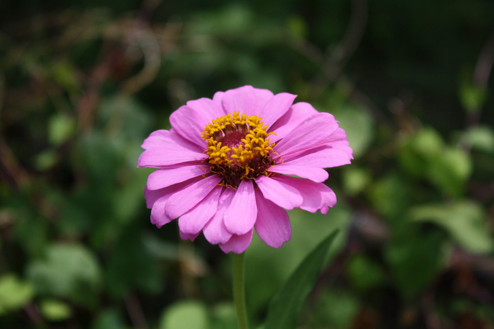

+++
title = "spring-summer 2019"
date = 2021-07-09T13:28:40-05:00
description = "kū from spring-summer 2019"
summary = "a year into my relationship with Parker"
categories = ["haiku","senryu"]
tags = ["spring","summer"]
draft = false
[schema]
  type = "ku"
[[copyright]]
  owner = "Zach Stoebner"
  date = "2021"
  license = "cc-by-nd-4.0"
[[resources]]
  src = "image/stately.JPG"
  name = "header thumbnail"
+++

# spring

spring’s robins --  
seeding the university soil   
my heart!  

raw bloom --  
the stately robin  
careens  

chapter ends  
because nobody seems to remember  
what happened  

a sharp edge just begging to make a cut.  
the cold hurts  

# summer

the wildfire -- rays leave skin red and irradiated  

you have commitment  
lacking in dialogue :  
or so he said  

slithering sweat  
weaves from tree to tree :  
spotted light  

lone zinnia  
against the mad king  
he stands so tall  

