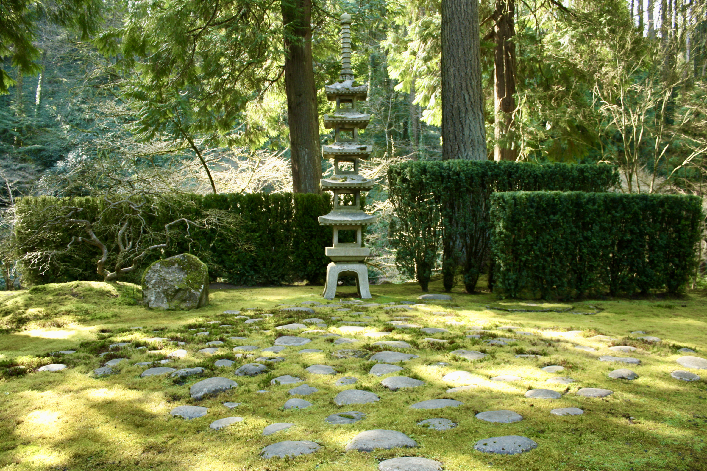

+++
title = "spring-summer 2020"
date = 2021-08-13T19:05:50-05:00
showmeta = true
description = "kū from spring-summer 2020"
summary = "trip to Portland into Pandemia"
categories = ["haiku","senryu"]
tags = ["spring","summer"]
draft = false
[schema]
  type = "ku"
[[copyright]]
  owner = "Zach Stoebner"
  date = "2021"
  license = "cc-by-nd-4.0"
[[resources]]
  src = "image/oasis.JPG"
  name = "header thumbnail"
+++

# spring

gods falling  
from the sky --  
water rushes  

spring mother :  
carried bags of groceries  
her sun babies  

my spirit animal  
found his heavenly rest :  
the spring robin  

the green samurai --  
nears me with day light  
and his stone  

# summer

equivocation : to some I’m “weird,” or even “cool”  
those words mean nothing  
