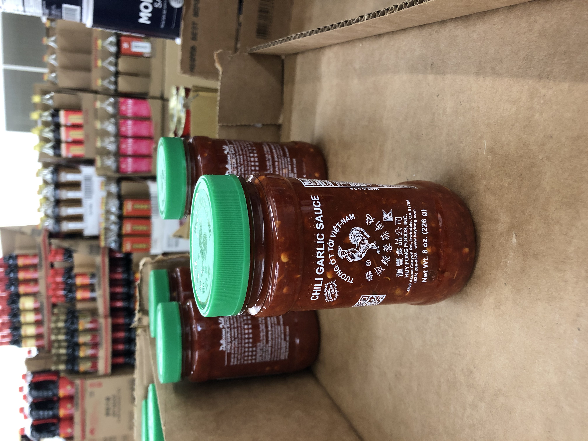

+++
title = "spring-summer 2021"
date = 2021-10-13T23:07:42-05:00
description = "kū and tanka from spring-summer 2021"
summary = "end of undergrad and feeling like the end is in sight"
categories = ["haiku","senryu","tanka"]
tags = ["spring","summer"]
draft = false
[schema]
  type = "ku"
[[copyright]]
  owner = "Zach Stoebner"
  date = "2021"
  license = "cc-by-nd-4.0"
[[resources]]
  src = "image/sir.JPG"
  name = "header thumbnail"
+++

# spring

dogwoods wish petals  
sending warm love --  
ambient footsteps  

first crop --  
gradually startles   
a Conscience  
dreams of farms and glory  
sweaty sinews; love’s rhythm  

---

two days in a row  
battle, good and evil  
no grey in community  

past shame  
some how withers  
I harden  

will I ever be enough?  

---

first world problem   
is privilege knowing  
life ends well  

how long?   
my child trains  
dimensions  

filtered   
... unfiltered  
filter  

# summer

dogwood blooms --  
loving each other, overflowing  
the edge of the pond  

residential concrete  
crow caws to robin  
unfenced front yard  

words light the gas  
doubt billows from the subcortex --  
gloom sizzles inside  

cloudy waves   
their turbulent serenity  
reflecting lifetime  

serotonin  
spurs   
inspiration ...  
for  
sunburnt  
shoulders  

Haiku summer --  
Reading poet’s names  
A big world  

building your own website  
= pure ontology  

atop a slant  
there is the hospital  
storm ... pending  

binary songbird :  
leaps from signpost to branch  
on leeward gust  

city’s peace :   
my father’s infinite chagrin  
vanishes  

phone eats first the simple dishes are rarely bland  

ball moss...  
between my fingertips  
springs trickle  

image search  
is mother of us all --  
in a desolate scape  

heat in the shade --  
cocktail opposed to coffee  
shunning me again  

pixel rain  
falling to a dubstep beat  
L, L L  

hacking away  
at wood and python   
also my forehead  

poems are my spells cast away free  

chilly morning dew :  
shapes the river valley  
crescent of clouds  

summer eve --   
together on the wood  
the taste of sambal  

warmth of coffee  
at the Korean market  
a heartfelt friend  

