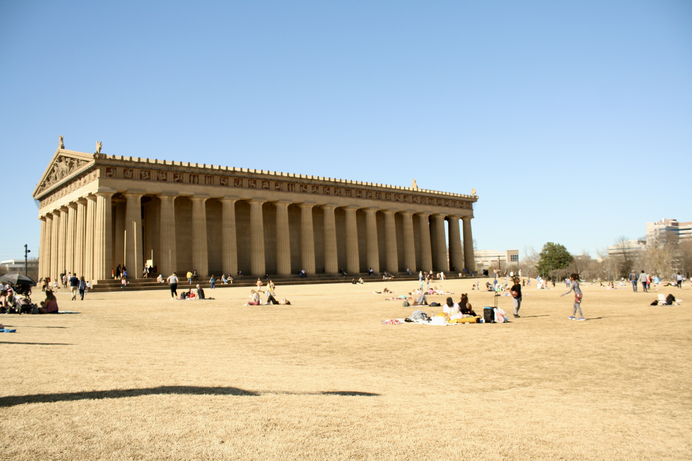
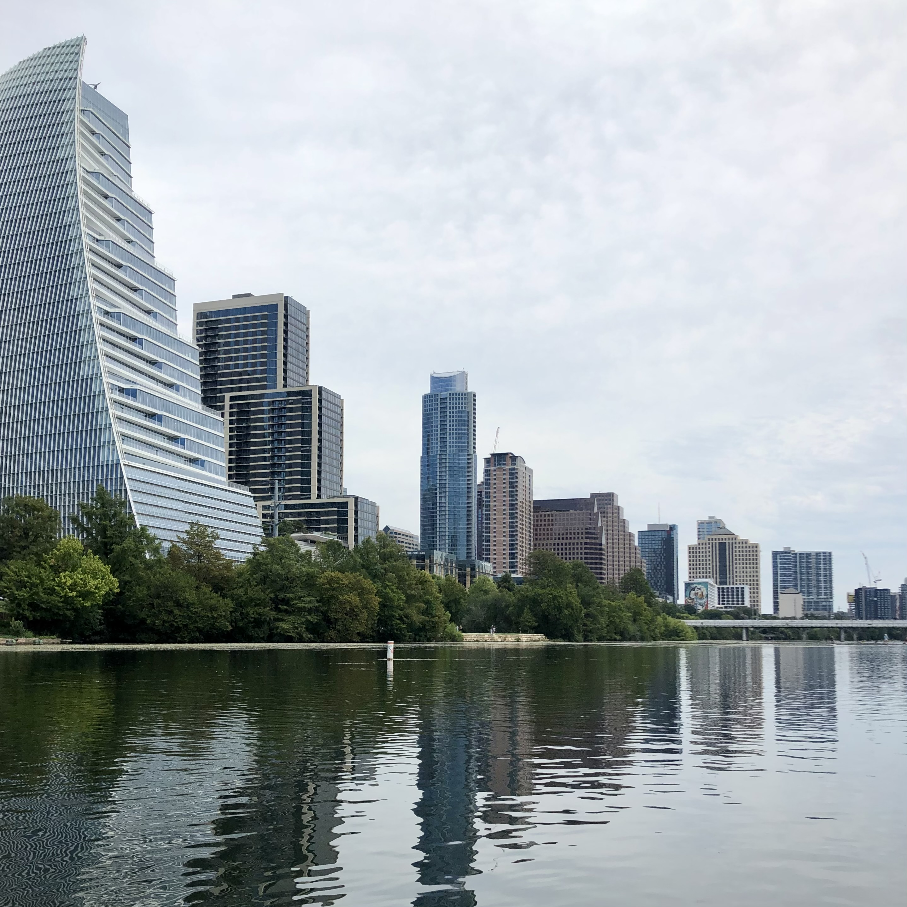
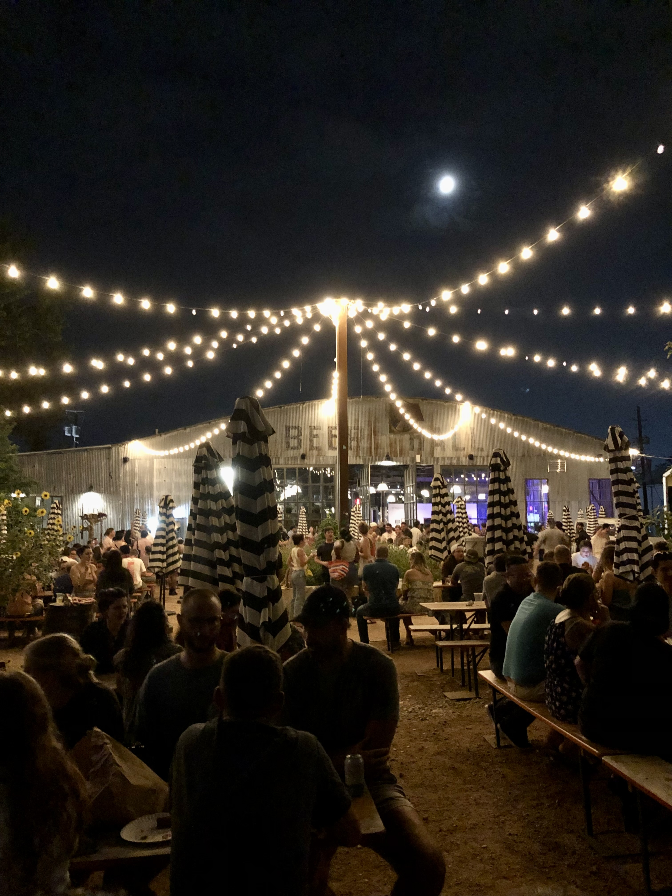

+++
title = "spring-summer-2022"
date = 2022-09-20T22:58:46-05:00
description = "kū and tanka from spring-summer 2022"
summary = "final girl in the Vandy horror picture show moves to Austin"
categories = ["haiku","senryu", "tanka"]
tags = ["spring","summer"]
draft = false
[schema]
  type = "ku"
[[copyright]]
  owner = "Zach Stoebner"
  date = "2022"
  license = "cc-by-nd-4.0"
[[resources]]
  src = "image/lbl.jpeg"
  name = "thumbnail"
+++

# spring

purple blooms |  
for the first time  
in years  
they crunch beneath  
my old-aged thoughts  

my sum of work  
traverses two pages ::  
last Tennessee spring  

internal forces  
full moon in Pisces  
: quit deluding!  

# summer 

sweet smell  
of white wildflowers  
~«~«≈…‡…‡…‡  

blue moons  
eclipse at an angle  
then move away  

birds flock  
to cedar leaves,  
one last go  

air hums  
in cosmic threads  
at midnight  

