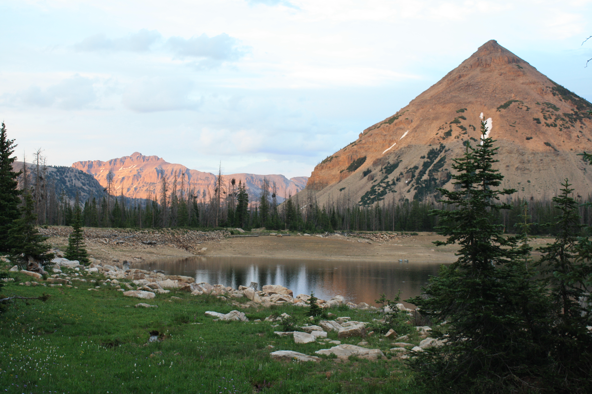
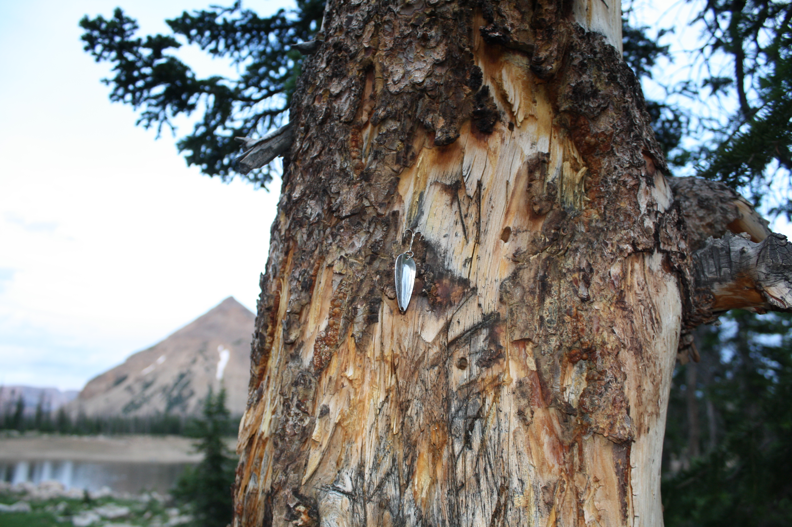
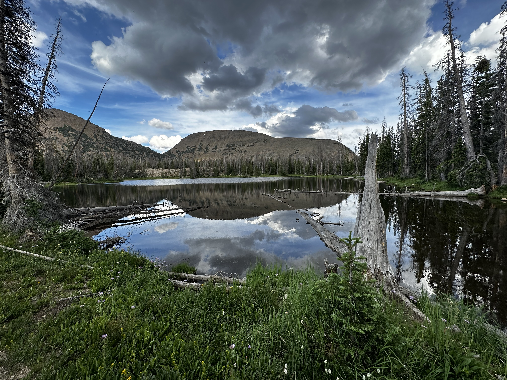
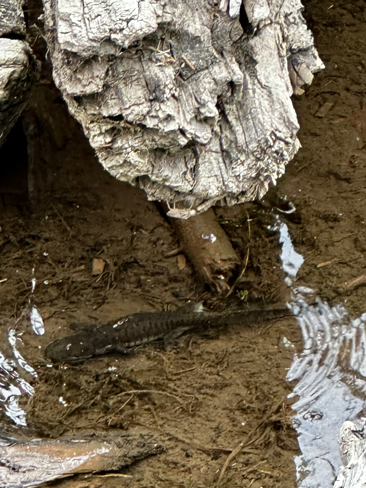

+++
title = "spring-summer 2023"
date = 2024-03-09T22:58:46-05:00
description = "kū and tanka from spring-summer 2023"
summary = "fighting for my life, from my desk to the wasatch"
categories = ["haiku","senryu", "tanka"]
tags = ["spring","summer"]
draft = false
[schema]
  type = "ku"
[[copyright]]
  owner = "Zach Stoebner"
  date = "2024"
  license = "cc-by-nd-4.0"
[[resources]]
  src = "image/marmot.jpeg"
  name = "thumbnail"
+++

# spring

wave pummels  
sadness washes up,  
rot in my brain,  
smoke in the Texas air  
portends a life, disastrous  

storms for weeks  
and Ventus’ heavy sighs :  
taps on skylight glass  

# summer 

wind tones  
cresting Uintas' ridge,  
birds court bees  

pine scent,  
citronella smoke swirls,  
chipmunk’s chirp me!  

lake in the mountains  
triangle, edges of dead trees  
salamander hunting grounds  

corner of my eye  
an eye around the corner,  
a wary stranger  

