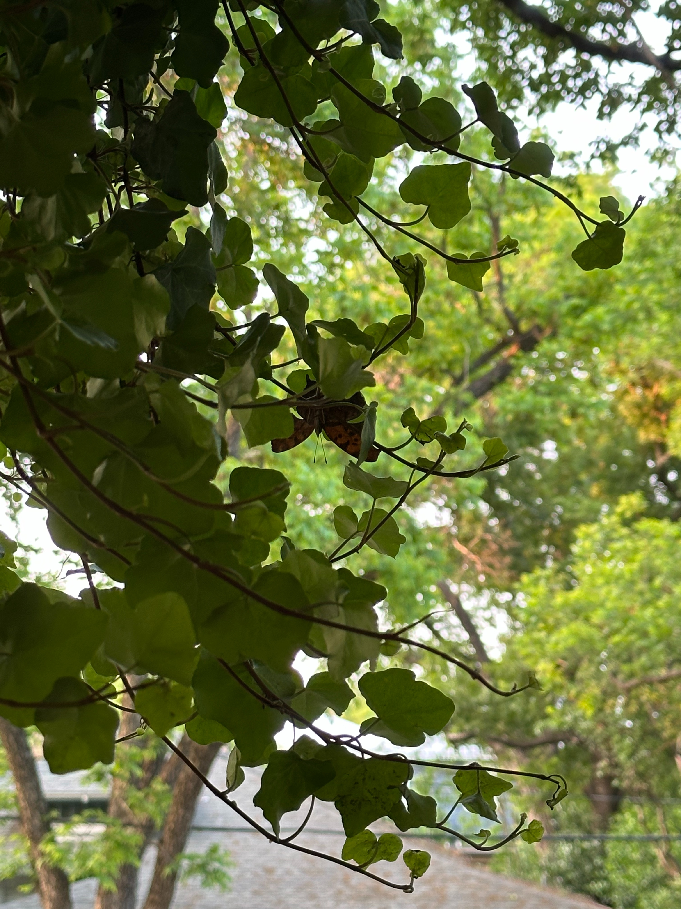
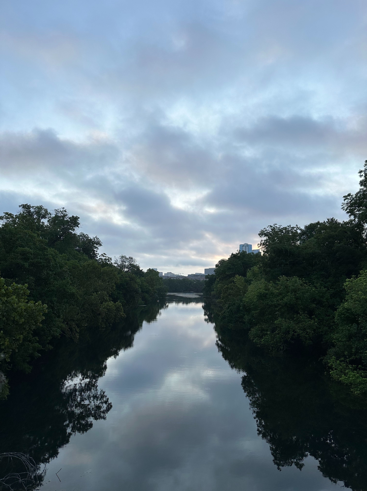
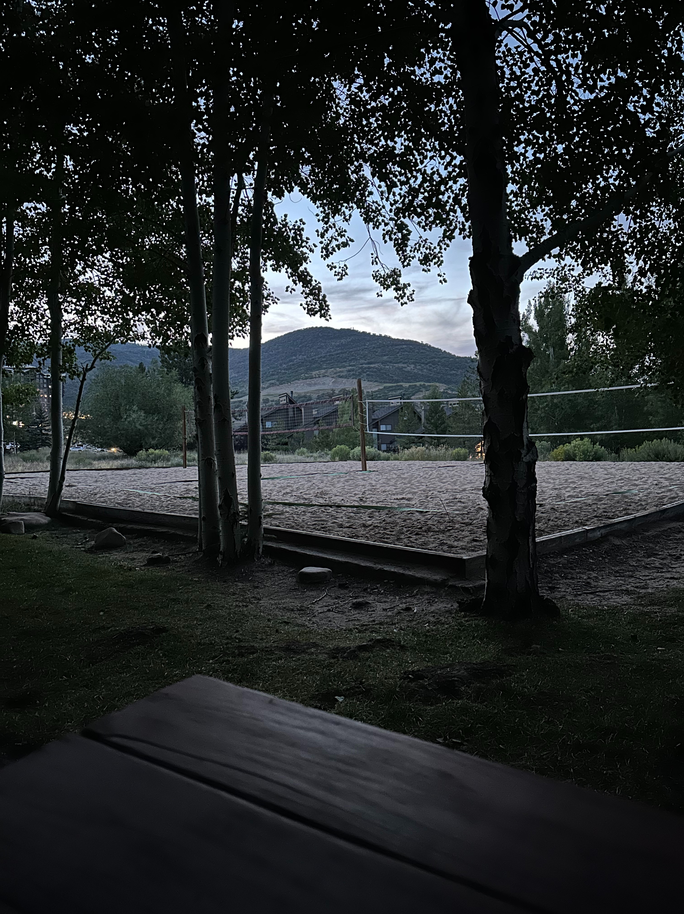

+++
title = "spring-summer 2024"
date = 2025-05-11T14:44:43-05:00
showmeta = true
description = "kū and tanka from spring-summer 2024"
summary = "spent lots of time outside "
categories = ["haiku","senryu", "tanka"]
tags = ["spring","summer"]
draft = false
[schema]
  type = "ku"
[[copyright]]
  owner = "Zach Stoebner"
  date = "2025"
  license = "cc-by-nd-4.0"
+++

## spring

springtails circle  
withering stalks of mint  
-- trees dance the Wind  

humid dew  
skin feels all pains  
deeply, in air  
weeks with many endings  
different shadows now  

old poems  
one slow one  
on the nose  

two women, sneezing  
squirrel traipsing on wire  
greeting mosquitoes  

## summer

towering above  
overtaking all observed  
rushing to the end  

never-ending flow  
the earth’s cold grasp, below  
ready for the end  

warring wasps  
finding a way back  
a poisoned home  

incarcerated house  
forsaken daughter wages  
god’s return, in Time  

slow day  
beneath strong wind  
restless peace  

soft twilight  
moisture in my breath  
chirp, chirp, hidden  

curious cardinal  
upon on leafy bough  
hovering to ground  

invert wooden corner  
spider webs a wee ant  
in mosquito humidity  

age unknown  
beneath my feet  
a Spanish cypress  

wade out  
stumbling on sand dip  
beneath the break  

moment of sadness,  
the problem-solving teacher  
waxing wasp’s nest  

vapor bombards skin :  
trio of house sparrows  
resilient, wooden  

soft strummed tones  
fossilized paws beneath  
my feet, a springs  

scent of the pine  
twilight sways with wind  
cresting a rocky giant  

crickets at my feet  
flutters the bush warbler  
-- a piny refuge  

