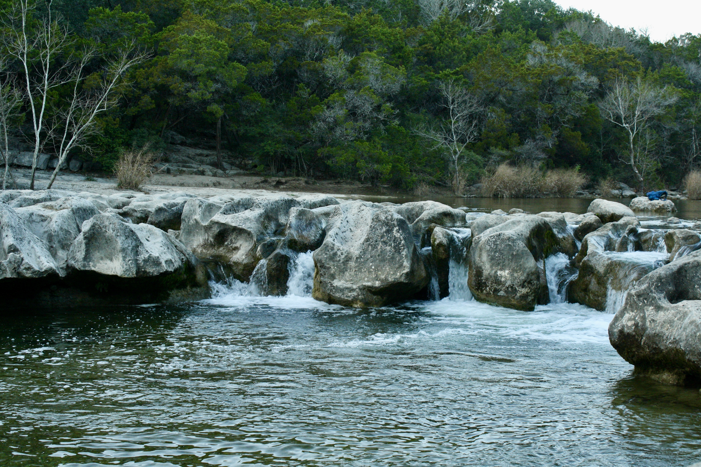
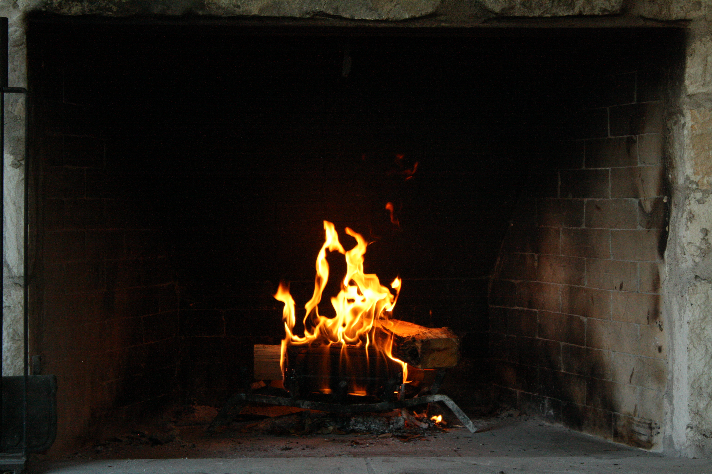

+++
title = "winter 2021-2022"
date = 2022-03-19T23:36:13-05:00
showmeta = true
description = "kū and tanka from winter 2021-2022"
summary = "immense freedom, relief, and growth in what felt like the coldest winter"
categories = ["haiku","senryu"]
tags = ["winter"]
draft = false
[schema]
  type = "ku"
[[copyright]]
  owner = "Zach Stoebner"
  date = "2022"
  license = "cc-by-nd-4.0"
[[resources]]
  src = "image/erosion.JPG"
  name = "header thumbnail"
+++

ear wind of walking through plain of grass | overhead  

daddy fishing ::  
a Star in my lens  
before the falls  

city search  
for sex sounds and sin :  
morning cloud ahead  

The Mat  
is an Ontology  
for Yoga  

---

body aches  
under oppressive light  
of clear winter  

pupils burn  
as cold sun peers  
behind branches  

---

flock of days  
already far away  
still undone  

blue fields  
of teeming aura  
bestow: life  

peace found  
in a puff jacket --  
winter’s green  

alone in bed  
but not my own ::  
drunk head  

open heart  
pasted to the window  
one eye open  

---

zen numbness  
after my youth, cathartic  
hairy sex  

storm’s warmth  
after my abandon youth  
at winter’s end  

---

a cloudy sky :  
offering clarity  
never known  

feather wisps  
courting chirps at last ::  
only edges freeze  
