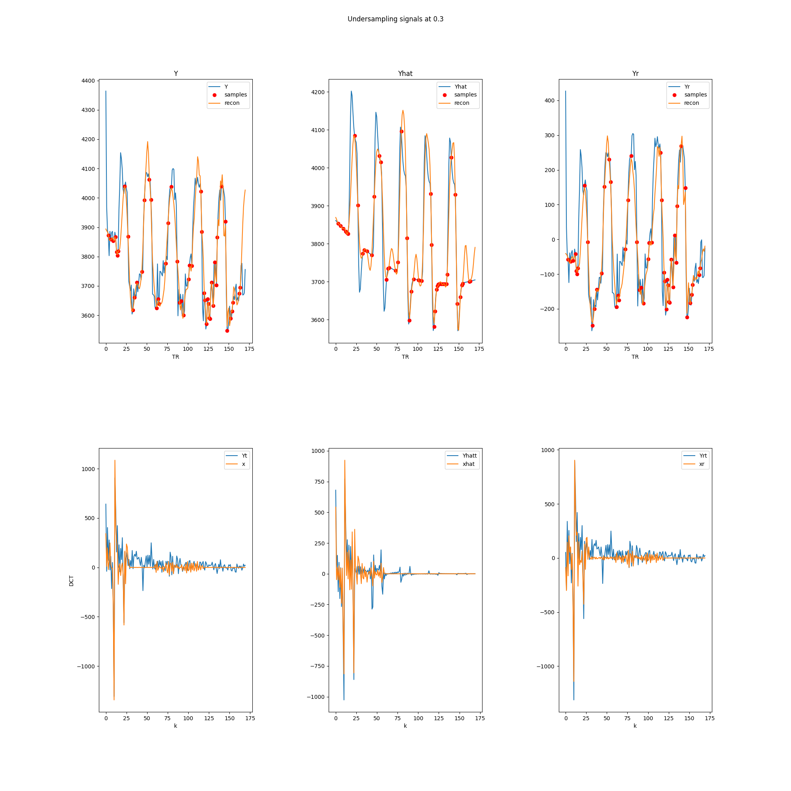
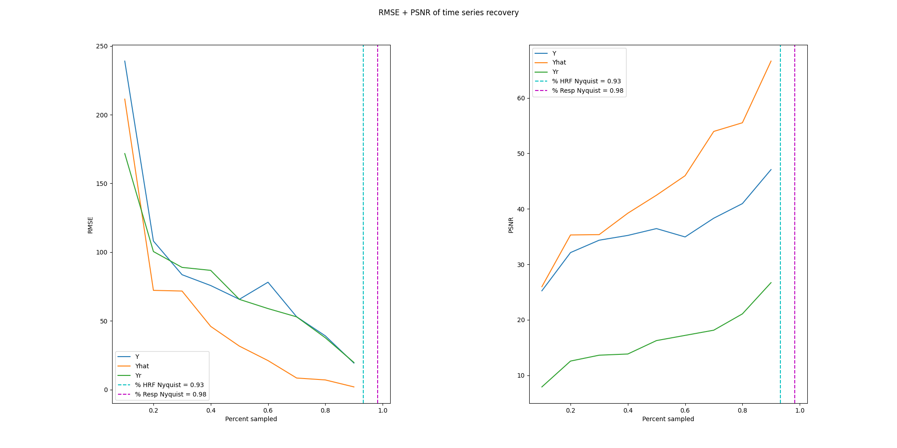
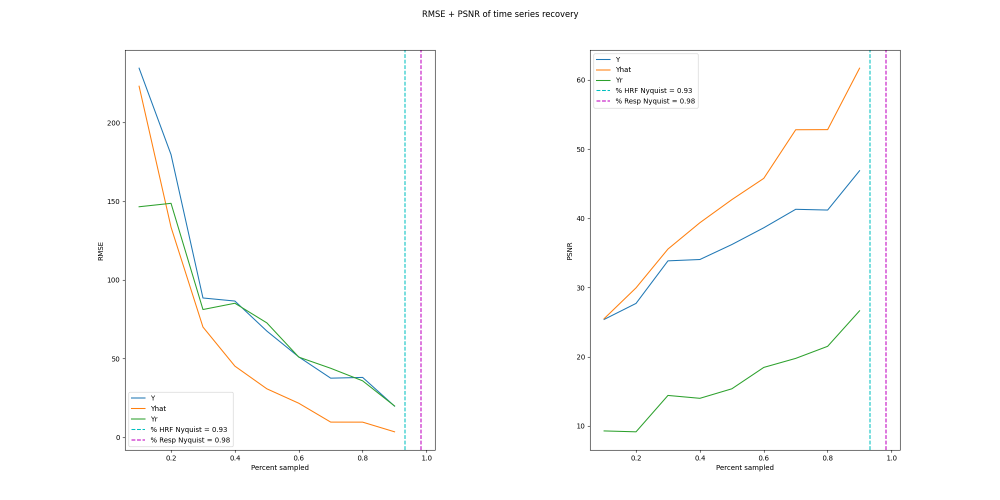
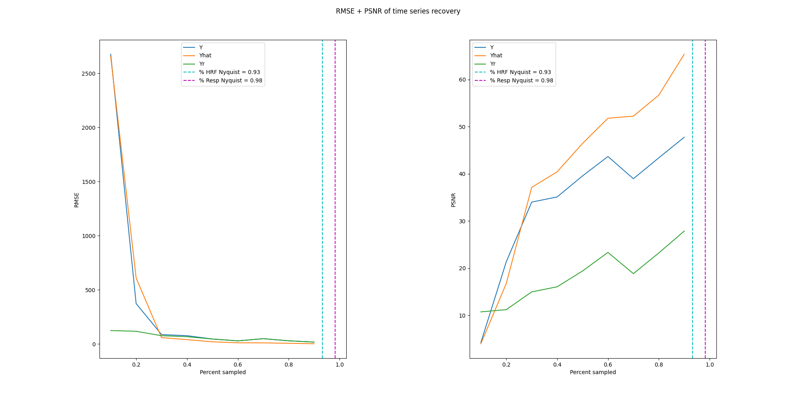

+++
title = "exploring compressed sensing fMRI time series"
date = 2022-05-31T13:26:14-05:00
showmeta = true
description = "we are once again solving systems of equations"
summary = "An exploration of compressed sensing fMRI time series with 3 different algorithms. Typically, compressed sensing reconstructs a single volume of MRI but fMRI are composed of many volumes; sensing along the time domain could reduce the number of volumes required. Of the 3 algorithms, BSBL-BO performed the best with the error curve elbowing around 30% subsampling."
categories = ["course", "solo"]
tags = ["opt", "control", "stats", "python", "ai", "sigproc"]
draft = false
toc = true
[schema]
  type = "project"
[[copyright]]
  owner = "Zach Stoebner"
  date = "2022"
  license = "cc-by-nd-4.0"
[[resources]]
  src = "image/thumb.png"
  name = "thumbnail"
  title = "compressed sensing from 30% subsampling using the BSBL-BO algorithm"
+++

<figure>
 
<figcaption>Signal sensing at 30% undersampling using the BSBL-BO algorithm. `$Y_i$` corresponds to time-domain signals whereas `$x_i$` corresponds to frequency-domain signals.</figcaption>
</figure>

**tl;dr** An exploration of compressed sensing fMRI time series with 3 different algorithms. Typically, compressed sensing reconstructs a single volume of MRI but fMRI are composed of many volumes; sensing along the time domain could reduce the number of volumes required. Of the 3 algorithms, BSBL-BO performed the best with the error curve elbowing around 30% subsampling. 

# Links
[repo](https://github.com/zstoebs/CSfMRI-TS)

[report](/doc/stoebnza_eece8396_report.pdf)

# Abstract
Compressed sensing reconstructs signals by solving underdetermined linear systems under the con- ditions that the measurements are sparse in the domain and incoherent [1]. In engineering, if measurements are taken within an appropriate basis satisfying the restricted isometry property, i.e., the Gaussian, Bernoulli, or Fourier bases, then this prior structure makes full signal recovery possible [2].

Compressed sensing is challenging with fMRI because the temporal dynamics of hemodynamic signals are relatively slow compared to other fast-acquisition signals that historically benefit from compressed sensing [3]. Additionally, having fewer samples insinuates a loss of statistical power in subsequent analyses. Thankfully, fMRI signals boast two beneficial characteristics that are promising for compressed sensing: 1. they are linear time-invariant, and 2. they lie within, and can transformed by, a Fourier basis [4].

In medical imaging, it is often assumed that an image is sampled at the Nyquist rate, s.t., enough discrete measurements are taken to reconstruct a continuous whole (M > N) without loss of information. If high-fidelity reconstruction is possible sampling below the Nyquist rate, then MRI modalities would benefit since discerning a signal and quickly turning over an analysis reduces real costs. These potential gains beg the question: if an underdetermined linear system can be solved after sampling below the Nyquist rate, can we collect fewer samples and still recover a high-quality fMRI under a compressed sensing paradigm? The purpose of this project is to explore approaches to compressed sensing that yield meaningful signal recoveries from heavy undersampling.

# Results
<figure>
 
<figcaption>Summary metrics of RMSE (left) and PSNR (right) voxel time series recovery using L1 minimization in a pure convex optimization formulation solved with the ECOS algorithm.</figcaption>
</figure>

<figure>
 
<figcaption>Summary metrics of RMSE (left) and PSNR (right) voxel time series recovery using L1 minimization in a pure convex optimization formulation solved with the OWL-QN algorithm.</figcaption>
</figure>

<figure>
 
<figcaption>Summary metrics of RMSE (left) and PSNR (right) voxel time series recovery using L1 minimization in a pure convex optimization formulation solved with the BSBL-BO algorithm.</figcaption>
</figure>

# References
[1] E. J. Candes et al., “Compressive sampling,” in Proceedings of the international congress of mathematicians, vol. 3, pp. 1433–1452, Citeseer, 2006.

[2] D. Angelosante, G. B. Giannakis, and E. Grossi, “Compressed sensing of time-varying signals,” in 2009 16th International Conference on Digital Signal Processing, pp. 1–8, IEEE, 2009.

[3] X. Zong, J. Lee, A. J. Poplawsky, S.-G. Kim, and J. C. Ye, “Compressed sensing fmri using gradient-recalled echo and epi sequences,” NeuroImage, vol. 92, pp. 312–321, 2014.

[4] O. Jeromin, M. S. Pattichis, and V. D. Calhoun, “Optimal compressed sensing reconstructions of fmri using 2d deterministic and stochastic sampling geometries,” Biomedical engineering online, vol. 11, no. 1, pp. 1–36, 2012.

[5] A. Domahidi, E. Chu, and S. Boyd, “ECOS: An SOCP solver for embedded systems,” in European Control Conference (ECC), pp. 3071–3076, 2013.

[6] G. Andrew and J. Gao, “Scalable training of l 1-regularized log-linear models,” in Proceedings of the 24th international conference on Machine learning, pp. 33–40, 2007.

[7] Z. Zhang and B. D. Rao, “Extension of sbl algorithms for the recovery of block sparse signals with intra-block correlation,” IEEE Transactions on Signal Processing, vol. 61, no. 8, pp. 2009– 2015, 2013.

[8] P. Wolfe, “Convergence conditions for ascent methods,” SIAM Review, vol. 11, no. 2, pp. 226– 235, 1969.

[9] H. Park and X. Liu, “Study on compressed sensing of action potential,” arXiv preprint arXiv:2102.00284, 2021.

[10] A. Jalal, M. Arvinte, G. Daras, E. Price, A. G. Dimakis, and J. Tamir, “Robust compressed sensing mri with deep generative priors,” Advances in Neural Information Processing Systems, vol. 34, pp. 14938–14954, 2021.

[11] X. Li, T. Cao, Y. Tong, X. Ma, Z. Niu, and H. Guo, “Deep residual network for highly accel- erated fmri reconstruction using variable density spiral trajectory,” Neurocomputing, vol. 398, pp. 338–346, 2020.
