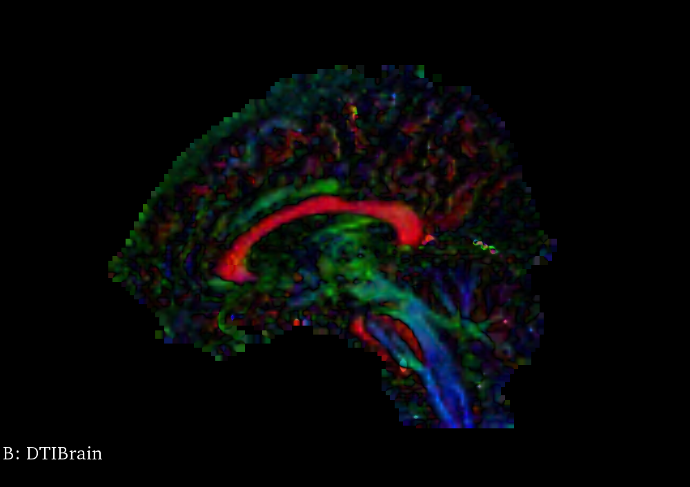
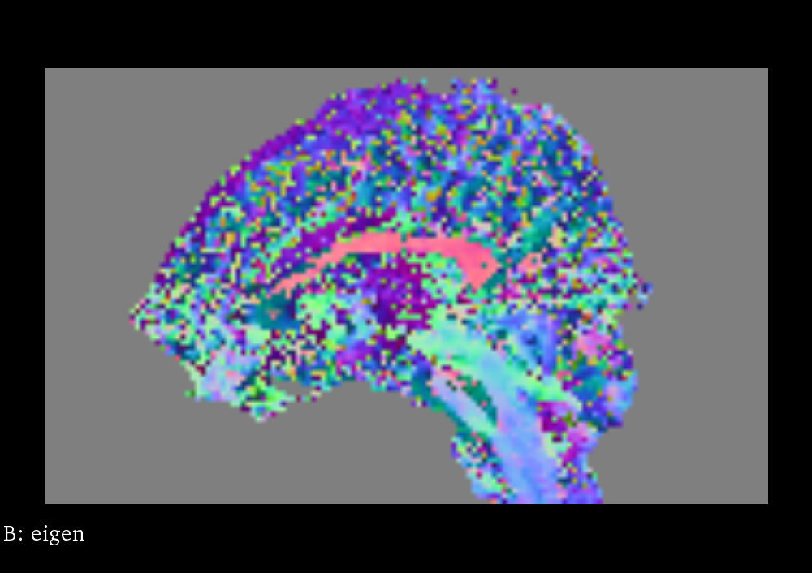
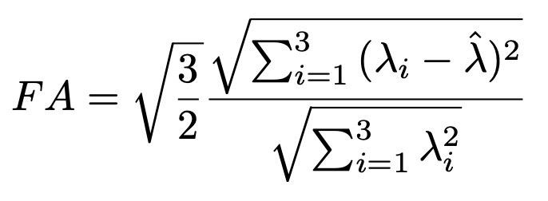
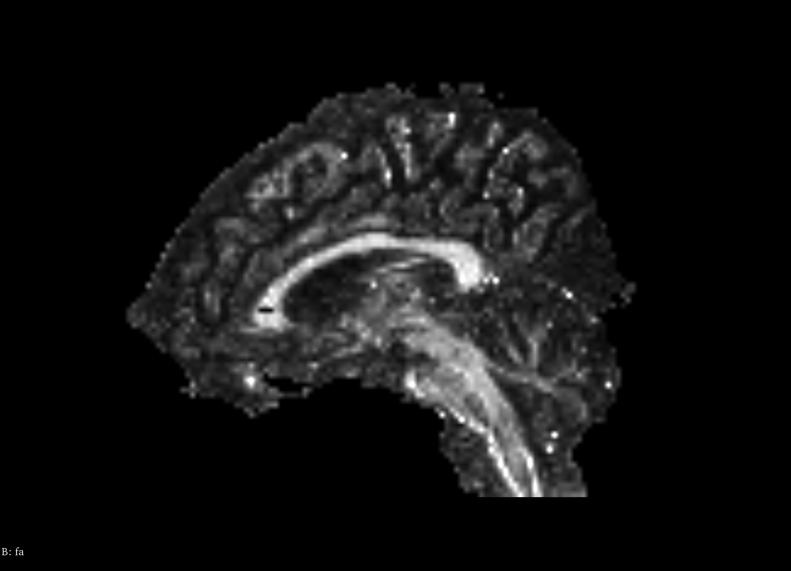
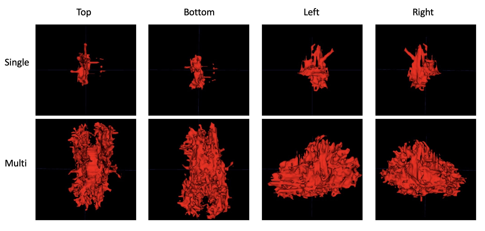

+++
title = "on fiber tracking"
date = 2021-11-16T13:50:49-06:00
description = "Take a little swim through your brain canals!"
summary = "After brief description of diffusion tensor images and what information they provide, I discuss an intuitive seed-based line propagation algorithm for computing a tractography map of a neuroimage. The open-source softwares required are [3D Slicer](https://www.slicer.org), [ITK](https://itk.org) for C++, and [ITK-SNAP](http://www.itksnap.org/pmwiki/pmwiki.php)."
categories = ["algo"]
tags = ["neuroimaging", "C++"]
draft = false
[schema]
  type = "note"
[[copyright]]
  owner = "Zach Stoebner"
  date = "2021"
  license = "cc-by-nd-4.0"
[[resources]]
  src = "image/dti_axial.png"
  name = "header thumbnail"
  [resources.params.meta]
    description = "axial slice of a diffusion tensor image"
+++

**tl;dr** After brief description of diffusion tensor images and what information they provide, I discuss an intuitive seed-based line propagation algorithm for computing a tractography map of a neuroimage. A stack of open-source softwares that can be used to implement diffusion tensor tractography are [3D Slicer](https://www.slicer.org), [ITK](https://itk.org) for C++, and [ITK-SNAP](http://www.itksnap.org/pmwiki/pmwiki.php). 

<i>The diffusion tensor image used to generate all figures is publically available as sample data, DTIBrain, via 3D Slicer.</i>

# Diffusion Tensor Imaging
In a diffusion tensor image (DTI), each voxel is represented by a symmetric tensor with 6 distinct values for the speed of water diffusion, corresponding to the directions from the center of the cubic voxel to each of its faces. Without obstruction, water diffusion is uniform on average in every direction; however, in spaces that alter diffusion, the values in each of these directions are anisotropic. Anisotropic diffusion gives rise to a principal axis of diffusion where some forward and backwards direction have greater values than the rest. Hence, the tensor at the voxel can be visualized as an ellipsoid – the elastic deformation of the cube along the principal axis.

<figure>
 
<figcaption>Sagittal slice of a DTI. 3D Slicer visualizes DTI well with a color orientation scheme, where red means that the principal eigenvector is along the left-right axis, blue means its along the inferior-superior axis, and green means its along the anterior-posterior axis. Intermediate colors means that its along a linear combination of these basis vectors.</figcaption>
</figure>
 

## Principal Eigenvector
The major eigenvector from each diffusion tensor gives the forward direction of the principal axis; the negation of the major eigenvector is the backwards direction. Precomputing this vector image, with one vector at each voxel, yields a map that can be used to route the line propagation algorithm through the brain's tracts. ITK defines a DiffusionTensor3D type that can set as the pixel type for an image; the type also defines a function for computing its eigendecomposition, which can be called when the pixel is accessed by an iterator. 

<figure>
 
<figcaption>Sagittal slice of the principal eigenvector image of the DTI. Although it's noisy, you can see that there is still structure to it that makes sense, i.e., in the corpus callosum and the brain stem.</figcaption>
</figure>
 

## Fractional Anisotropy
Fractional anisotropy (FA) is a scalar value computed from the eigenvalues of the diffusion tensor to quantify the amount of anisotropic diffusion at a voxel in the DTI [3]. A high value insinuates that water diffuses along a single axis, which would correspond to water flowing through a tract. FA for a 3x3 diffusion tensor is computed as follows: 

<figure>
 
<figcaption>The formula to compute the scalar FA value, which is solely based on the eigenvalues, where the capped lambda is the mean of the eigenvalues.</figcaption>
</figure>
 

When performing tractography, an FA value that is too low implies that water diffusion is largely isotropic, e.g., in grey matter, where there are no tracts. Hence, a minimum FA can be set and used as a stopping condition at a given voxel. ITK's DiffusionTensor3D type defines a function to compute the FA value of the tensor and can be accessed in the same way as the eigendecomposition function. 

<figure>
 
<figcaption>Sagittal slice of the FA image of the DTI. The FA image looks strikingly similar to a structural MRI.</figcaption>
</figure>
 

# Tractography
With the directional values, a line can be propagated from a seed voxel along the 3D vector field to reconstruct a 3D tract down the two directions of the principal axis [1]. By propagating a line from a seed, or from many seeds, a rudimentary tractography map of a DTI can be computed. Although line propagation is intuitive and relatively lightweight, it is worth noting that other fiber tracking techniques exist that are both more robust and more intensive [2].

The stopping conditions: 
1. Current iteration is greater than the max number of iterations chosen by the user.
2. The candidate voxel is outside of the image.
3. The FA at the candidate voxel is below the minimum FA acceptable chosen
by the user.
4. The candidate voxel has already been visited.

If no stopping condition was met, then the current voxel was visited, meaning:
1. The candidate voxel in the tractography image was set to a non-negative integer.
2. The eigenvector at the candidate voxel was extracted, multiplied by some step size ∆ chosen by the user, added and subtracted from the candidate voxel’s index, and then pushed to the back of the list.
3. Finally, the candidate voxel was popped from the front of the list and the iteration was incremented.

For this task, line propagation can be implemented both iteratively or recursively because it is isomorphic to search algorithms, i.e., breadth-first and depth-first search. Switching between the two is pretty straightforward as the function definitions should not be very different. That said, the recursive algorithm is likely less bloated and more effective computationally, but might be much slower if you're using ITK in Python rather than C++. 

<figure>
 
<figcaption>Views of a tractography image generated by a single seed (top) and multiple seeds from a segmentation image (bottom) for ∆ = 0.9, minimum FA at 0.1, and the maximum number of iterations at 10000. The orientation of the views is given on the top. As expected, multi-seed input generated a much more extensive tractography map.</figcaption>
</figure>
 

# References
[1] Mori S, van Zijl PC. Fiber tracking: principles and strategies - a technical review. NMR Biomed. 2002 Nov-Dec;15(7-8):468-80. https://doi.org/10.1002/nbm.781. PMID: 12489096.

[2] Kleiser R, Staempfli P, Valavanis A, Boesiger P, Kollias S. Impact of fMRI- guided advanced DTI fiber tracking techniques on their clinical applica- tions in patients with brain tumors. Neuroradiology. 2010 Jan;52(1):37-46. https://doi.org/10.1007/s00234-009-0539-2. Epub 2009 May 29. PMID: 19479248.

[3] Basser PJ, Pierpaoli C. Microstructural and physiological features of tissues eluci- dated by quantitative-diffusion-tensor MRI. J Magn Reson B. 1996 Jun;111(3):209- 19. https://doi.org/10.1006/jmrb.1996.0086. PMID: 8661285.
