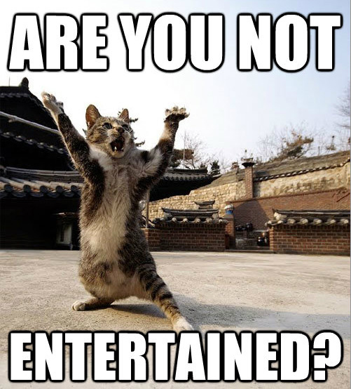

+++
title = "notes intro & intentions"
date = 2021-06-27T14:18:39-05:00
categories = ["me"]
description = "Briefly outlining my intentions for notes."
summary = "Welcome!"
draft = false
[schema]
 type = "note"
[[copyright]]
  owner = "Zach Stoebner"
  date = "2021"
  license = "cc-by-nd-4.0"
[[resources]]
  src = "image/catiator.jpg"
  name = "thumbnail"
  title = "Catiator: A Gladiator meme ... but different"
  [resources.params.meta]
    description = "Gladiator meme... but different"
    creator = "Alexander Woodward"
    sameAs = "https://www.byjovetheatre.org/are-you-not-entertained-a-look-at-not-happy-theatre/"
+++

<figure>
 
<figcaption>Catiator: A Gladiator meme ... but different</figcaption>
</figure>

Welcome!

To inaugurate my notes, here are my intentions: 
1. To collect and structure what I learn and ideate. 
2. To hopefully help and entertain weary travelers and passersby. 
