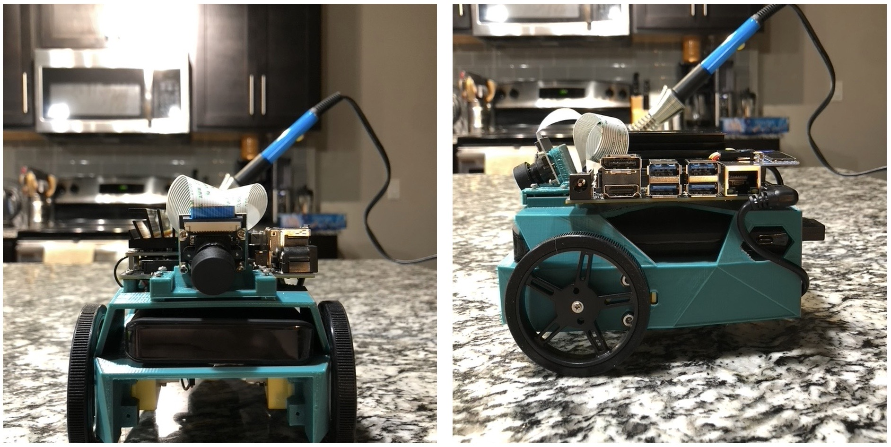
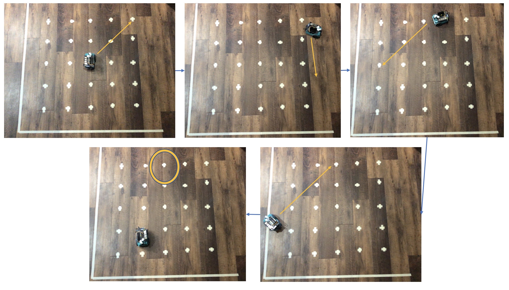
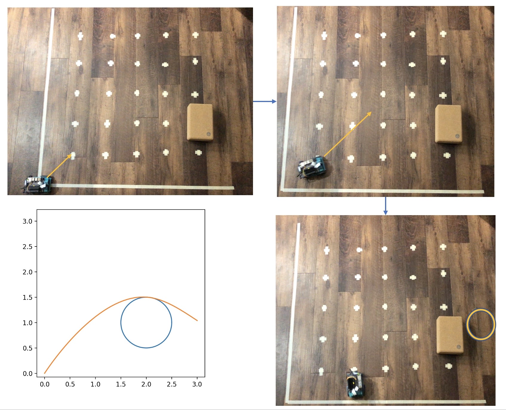
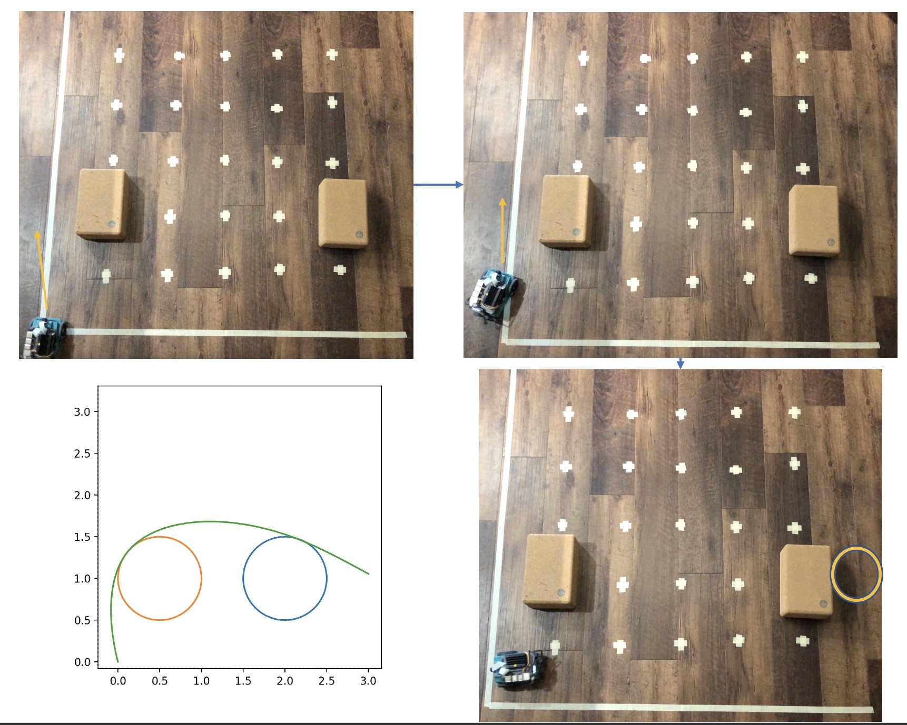
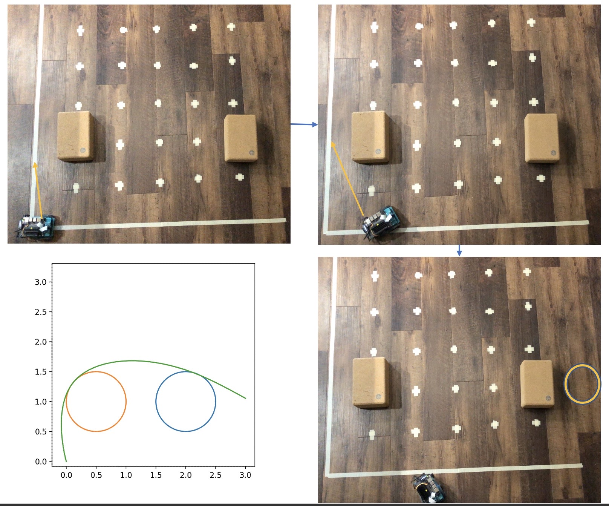
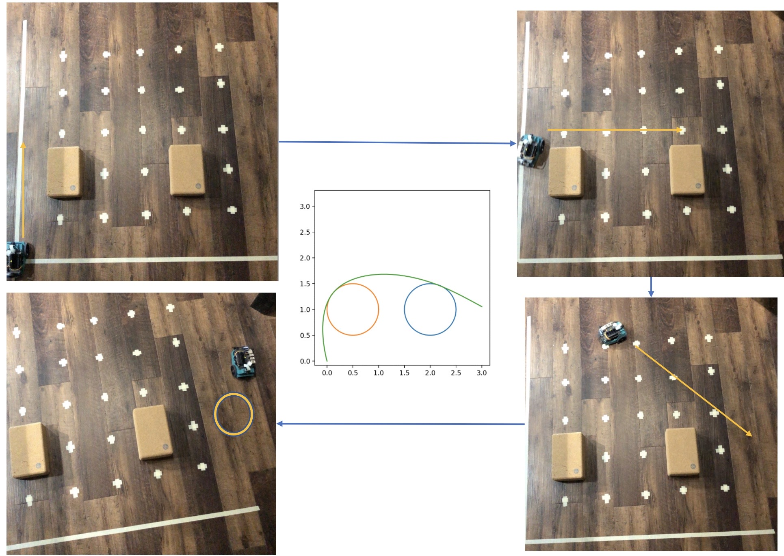

+++
title = "autonomous motion planning for an NVIDIA JetBot"
date = 2021-12-08T19:05:08-06:00
showmeta = true
description = ""
summary = "Built a JetBot + an exploration and novice implementation of motion planning on said JetBot. This computational game theory project marked my first foray into optimization and a glimpse of its power muahahaha. It ain't exquisite but it was heading in the right direction."
categories = ["course", "solo"]
tags = ["ai", "ml", "control", "opt", "cps", "robotics", "python"]
draft = false
toc = true
[schema]
  type = "project"
[[copyright]]
  owner = "Zach Stoebner"
  date = "2021"
  license = "cc-by-nd-4.0"
+++

<video width="100%" height="500px" controls>
  <source src="image/nonlinear.mp4" type="video/mp4">
</video>

**tl;dr Built a JetBot + an exploration and novice implementation of motion planning on said JetBot. This computational game theory project marked my first foray into optimization and a glimpse of its power muahahaha. It ain't exquisite but it was heading in the right direction.**

# Links

[repo](https://github.com/zstoebs/jetbot_motionplanning)

[report](/doc/zach_stoebner_CGT_project_report.pdf)

# Background

Although autonomous vehicles are the talk of the town these days, the methodologies behind them are elusive to most. To help yourself, I suggest reading my note on [LCPs](/notes/lcp) and then follow that up with section 3.1 of this thesis on [LMCPs](https://www.google.com/url?sa=t&rct=j&q=&esrc=s&source=web&cd=&ved=2ahUKEwiKzsKEztX0AhVUTDABHbt3DrEQFnoECAYQAQ&url=https%3A%2F%2Fescholarship.mcgill.ca%2Fdownloads%2F2z10ws808&usg=AOvVaw3x3QL54b3sOErLRdSzTeO5) and the [path solver for MCPs](https://www.researchgate.net/publication/250889964_The_path_solver_a_nommonotone_stabilization_scheme_for_mixed_complementarity_problems).

Path planning in autonomous vehicles is a booming research area with significant developments. Although computer vision and machine learning are often employed to plan motion in autonomous vehicles, computationally solving the optimization problems, that arise from in scenarios of motion planning, through a game theoretic is a lightweight alternative to path solving. In this scenario, the path planning optimization problem is formulated as a nonlinear complementarity problem (NCP) constrained by physics and simple car dynamics, which cannot necessarily be directly and exactly solved. Instead the NCP can be approximated by linear mixed complementarity problems (LMCPs), iteratively computing partial paths that together approximate the solution to the NCP and yield a motion planned trajectory for an autonomous vehicle.

The problem formulation is a non-visual scenario where stationary obstacles are laid out on a grid, in a predetermined fashion, and an optimal path must be computed through these obstacles to some goal point without exceeding bounds. Such paths are often nonlinear and can be closely approximated by solving linear mixed complementarity problems via a pathsolver algorithm. Once the path is determined, the JetBot must then move in a real setting, of which the software representation of the grid space is a projection.

# Building the JetBot

The JetBot was built following the documentation on the [JetBot homepage](https://jetbot.org/master/index.html). For the parts with multiple options: the IMX219-160 listed as the second option for cameras, the M2 card + antennas listed as the first option for wifi, and the 65mm wheels listed as the second option for wheels were used. The total cost was approximately $300. The hardware setup time was approximately twelve hours spread between two days. A significant portion of the time was spent extracting a screw terminal from the motor board that was placed incorrectly. 1 shows the completed JetBot hardware assembly.

# Motion

## Path Solver

[This notebook](https://github.com/zstoebs/jetbot_motionplanning/blob/main/nonvisual_pathplanning.ipynb) contains code for non-visual motion planning – the primary objective of the project. The code relies on an LMCP solver that takes an LMCP formulation in M, q, l, u, x 0 and returns a path of points of z, w, v, t. A pathsolver then iteratively solves LMCPs for Newton points along an overarching path, performing backward linesearch to progress sufficiently down each of these paths towards the predefined goal point.

Solving many LMCPs approximates a nonlinear path, which can be formulated as an NMCP for which the KKT conditions must first be derived. The KKT conditions are formulated symbolically so that KKT function as well as the Jacobian of the KKT can be passed to the pathsolver for sparse JIT evaluation, accelerating runtime. Once the point sequence is acquired, it is passed to a module for JetBot motion planning to attempt to move the JetBot along the equivalent trajectory on a real grid space.

## Motion Algorithms

To achieve the best motion possible on the JetBot, various motion planning algorithms were implemented: linear approximation, Manhattan (aka wiggle) motion, and proportional / integrative / derivative (PID) control. For some of these algorithms, the arctan2 function is used to compute the angle for turning from one orientation to another. (The full code for the JetBotMotion class is included in the appendix.)

arctan 2(∆y, ∆x)

The approximate relevant specifications measured for the JetBot were:

1. With two obstacles, sometimes the pathsolver fails if dt is too small =⇒ dt > 0.1

2. Confirmed that the solved states [x, y, v x , v y ] closely approximate the dynamics of horizontal motion

3. JetBot moves forward 40cm in 0.75 sec at speed=1

4. JetBot rotates 360 degrees in 1 sec at speed=1

# Results

<figure>

<figcaption>Figure 1. Fully assembled JetBot. The two views show the camera, ports, wheels, and overall build structure of the JetBot. In the background is the soldering iron used during assembly.</figcaption>
</figure>

<figure>

<figcaption>Figure 2. JetBot movement sequence for { (1, 1), (1, 0), (−1, 0), (−1, −1), (0, 1) } . Blue arrows indicate scene flow. The yellow arrow indicates the point that the JetBot should go to next; the yellow circle indicates the final location.</figcaption>
</figure>

<figure>

<figcaption>Figure 3. Attempted JetBot linear approximation movement on a single obstacle course. The bottom left pane is the predicted trajectory from the pathsolver. Blue arrows indicate scene flow. The yellow arrow indicates the point that the JetBot should go to next; the yellow circle indicates the final location.</figcaption>
</figure>

<figure>

<figcaption>Figure 4. Attempted JetBot linear approximation movement on a double obstacle course. The bottom left pane is the predicted trajectory from the pathsolver. Blue arrows indicate scene flow. The yellow arrow indicates the point that the JetBot should go to next; the yellow circle indicates the final location.</figcaption>
</figure>

<figure>

<figcaption>Figure 5. Attempted JetBot Manhattan movement on a double obstacle course. The bottom left pane is the predicted trajectory from the pathsolver. Blue arrows indicate scene flow. The yellow arrow indicates the point that the JetBot should go to next; the yellow circle indicates the final location.</figcaption>
</figure>

<figure>

<figcaption>Figure 6. Attempted JetBot PID control movement on a double obstacle course. The middle pane is the predicted trajectory from the pathsolver. Blue arrows indicate scene flow. The yellow arrow indicates the point that the JetBot should go to next; the yellow circle indicates the final location. This method resulted in a more correct, but still erroneous, path realization. </figcaption>
</figure>

# References
[Enzenhofer. "Numerical Solution of Mixed Linear Complementarity Problems in Multibody Dynamics with Contact." 2018](https://www.google.com/url?sa=t&rct=j&q=&esrc=s&source=web&cd=&ved=2ahUKEwjszOvY_rH0AhU9CjQIHQFBAx0QFnoECAMQAQ&url=https%3A%2F%2Fescholarship.mcgill.ca%2Fdownloads%2F2z10ws808&usg=AOvVaw3x3QL54b3sOErLRdSzTeO5)

[Dirkse, Steven & Ferris, Michael. (1995). The path solver: a nommonotone stabilization scheme for mixed complementarity problems. Optimization Methods & Software - OPTIM METHOD SOFTW. 5. 123-156. 10.1080/10556789508805606.](https://www.researchgate.net/publication/250889964_The_path_solver_a_nommonotone_stabilization_scheme_for_mixed_complementarity_problems)

[1] Pepy, R., Lambert, A., and Mounier, H., “Path planning using a dynamic vehicle model,” in [2006 2nd International Conference on Information Communication Technologies], 1, 781–786 (2006).
[2] Choset, H., La Civita, M., and Park, J., “Path planning between two points for a robot experiencing local- ization error in known and unknown environments,” (11 1999).
[3] Lozano-Perez, T., “A simple motion-planning algorithm for general robot manipulators,” IEEE Journal on Robotics and Automation 3(3), 224–238 (1987).
[4] Yonetani, R., Taniai, T., Barekatain, M., Nishimura, M., and Kanezaki, A., “Path planning using neural a* search,” in [International Conference on Machine Learning], 12029–12039, PMLR (2021).
[5] Lee, L., Parisotto, E., Chaplot, D. S., Xing, E., and Salakhutdinov, R., “Gated path planning networks,” in [International Conference on Machine Learning], 2947–2955, PMLR (2018).
[6] Mansouri, S. S., Kanellakis, C., Fresk, E., Kominiak, D., and Nikolakopoulos, G., “Cooperative coverage path planning for visual inspection,” Control Engineering Practice 74, 118–131 (2018).
[7] Dirkse, S. and Ferris, M., “The path solver: A non-monotone stabilization scheme for mixed complementarity problems,” Optimization Methods and Software 5 (12 1993).
[8] Andersson, J. A. E., Gillis, J., Horn, G., Rawlings, J. B., and Diehl, M., “CasADi – A software framework for nonlinear optimization and optimal control,” Mathematical Programming Computation (In Press, 2018).
[9] Araki, M., “Pid control,” CONTROL SYSTEMS, ROBOTICS, AND AUTOMATION 2.
