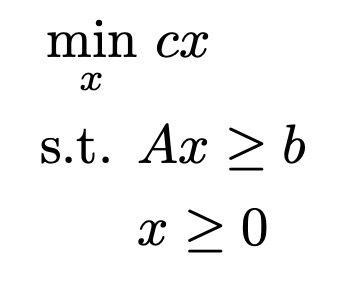
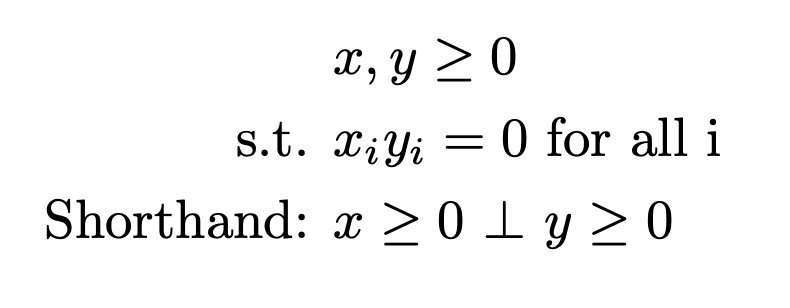
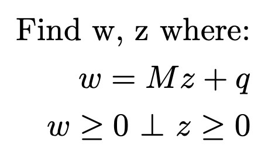
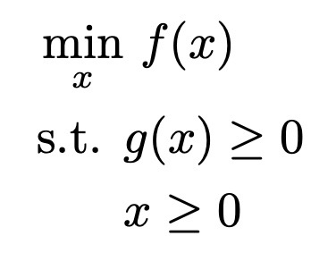
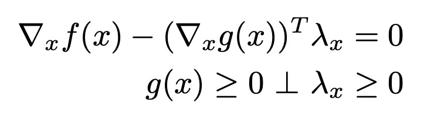
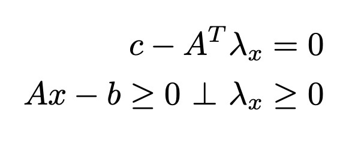
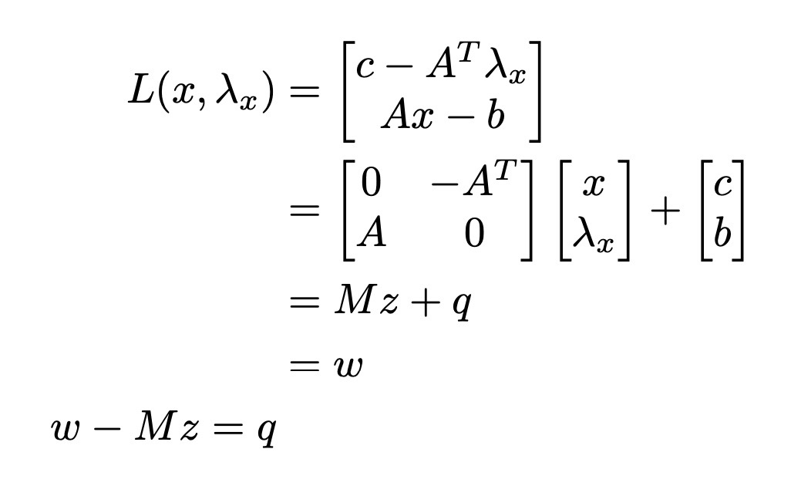
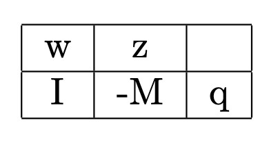
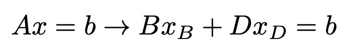

 +++
title = "on linear complementarity problems"
date = 2021-11-24T11:06:11-06:00
showmeta = true
description = "Solving systems of equations is the most important."
summary = "This Fall 2021, I am taking a course on computational game theory, which insofar is the formulation of various games (e.g. bimatrix, Stackelberg) as mathematical programs and the algorithms that solve them, or approximate solutions. Linear complementarity problems are foundational for computing Nash equilibria of simple games."
categories = ["algo"]
tags = ["cps", "robotics", "control", "opt", "ai"]
toc = true
draft = false
[schema]
  type = "note"
[[copyright]]
  owner = "Zach Stoebner"
  date = "2021"
  license = "cc-by-nd-4.0"
[[resources]]
  src = "image/thumb.png"
  name = "thumbnail"
  [resources.params.meta]
    description = "path computed with the PATH solver algorithm by approximating the solutions to linear mixed complementarity problems with linear complementarity problems"
+++

**tl;dr** This Fall 2021, I am taking a course on computational game theory, which insofar is the formulation of various games (e.g. bimatrix, Stackelberg) as mathematical programs and the algorithms that solve them, or approximate solutions. Linear complementarity problems are foundational for computing Nash equilibria of simple games. 

# Background
## Programming
A mathematical program is an optimization (min, max) over an objective function and constraints. A [linear program (LP)](https://en.wikipedia.org/wiki/Linear_programming) is one where the objective function and the constraints are all linear. 

<figure>
 
<figcaption>The general LP formulation.</figcaption>
</figure>
 

<i>Aside: The terms 'argmin' and 'argmax' are special terminology for returning the optimizing value of the argument, instead of the optimal value of the function.</i>

## Complementarity
A complementarity condition is a special kind of constraint required for solving [linear complementarity problems (LCPs)](https://en.wikipedia.org/wiki/Linear_complementarity_problem), as the name suggests. The non-negative vectors x and y are complements if one or both of the values at corresponding indices are 0. 

<figure>
 
<figcaption>The definition of complementarity.</figcaption>
</figure>
 

Complementarity results from a program's transformation into an LCP. Generally, it is not a constraint defined in the programs of the game. 

## Games & Equilibria
Intuitively, games are multiple programs that relate to each other. An equilibrium is a simultaneous joint solution that solves all optimization problems in a game. 

In Nash games, it is assumed that the opponent will always play their optimal move, so the player should always play their optimal move. A [Nash equilibrium](https://en.wikipedia.org/wiki/Nash_equilibrium) is a best player's best move without deviating from their predefined strategy, i.e., a matrix of costs for each of the player's moves against each of the opponent's moves. <u>Solving Nash games is the same as finding the Nash equilibria.</u> 

<i>Aside: John Nash proved that in every finite game all players can arrive at an optimal outcome.</i>

# Linear Complementarity Problem
An LCP is defined as: 

<figure>
 
<figcaption>The general form of an LCP.</figcaption>
</figure>
 

LCPs are important and useful, for both mathematical and computer, programming because they can be analytically and algorithmically solved. Therefore, any programs that can be transformed into an LCP can be solved through the LCP; for Nash games, solutions to the LCP are thus the Nash equilibria. 

## Karush-Kuhn-Tucker Conditions
The [Karush-Kuhn-Tucker (KKT) conditions](https://en.wikipedia.org/wiki/Karush–Kuhn–Tucker_conditions) are a set of first-order conditions using a program's objective function and constraints that must be satisfied by any optima. For the general form of a program: 

<figure>
 
<figcaption>The general form of a mathematical program.</figcaption>
</figure>
 

The KKT conditions are defined as: 

<figure>
 
<figcaption>The KKT conditions for a general program.</figcaption>
</figure>
 

<u>The KKT conditions of the programs in a Nash game can be composed into an LCP.</u> Solutions to the LCP satisfy the KKT conditions and are therefore Nash equilibria and solutions to the game. 
 
For the linear program above, the KKT conditions are: 

<figure>
 
<figcaption>The KKT conditions for a linear program.</figcaption>
</figure>
 

which can then be composed into a function of the following form: 

<figure>
 
<figcaption>The KKT conditions as a function for an LCP.</figcaption>
</figure>
 

Complementarity conditions can then be enforced over this function of KKT conditions to form an LCP. Voilà!

Other programs, e.g., [quadratic programs (QPs)](https://en.wikipedia.org/wiki/Quadratic_programming), can also be massaged into LCPs by stacking their KKT conditions in this way. Some problems can be massaged into complementarity problems, but not necessarily LCPs. Amusingly, the solutions to those problems are often approximated by solving LCPs. 

# Lemke's Method
[Lemke's method](https://en.wikipedia.org/wiki/Lemke%27s_algorithm) is a pivoting algorithm for computationally finding solutions to LCPs. The rearranged equation above can be organized into a tableau of the form: 

<figure>
 
<figcaption>The tableau to solve the LCP via Lemke's method.</figcaption>
</figure>
 

You may already see that <u>essentially finding solutions to the LCP is solving a system of equations</u>. However, since the tableau is a wide matrix, the system is underdetermined so there are infinitely many solutions, i.e., they lie in a conic region defined by complementary pairs of columns in the tableau, or no solutions, i.e., if q is not contained in any complementary cone. 

For n variables in the z vector, there are necessarily 2n columns in the tableau with the n slack variables for w. Because of the stacked KKT conditions in the function, there are n rows. This suggests that any n of the variables, defined by their corresponding columns, can form a basis B to define the conic region containing a feasible solution. The decomposition of the system into basis and non-basis parts:  

<figure>
 
<figcaption>The decomposition of an undetermined system into basis and non-basis components.</figcaption>
</figure>
 

Since B is a basis of linearly independent columns, it can be inverted and the basis variables can technically determined that way. However, these matrices can be enormous in practice and inverting a matrix is very computationally expensive. Thankfully, iteratively [pivoting](https://people.richland.edu/james/lecture/m116/matrices/pivot.html) the tableau is one way to accomplish the same goal without ever needing to invert a giant matrix. The high-level steps are: 

1. Use a minimum ratio test to determine the exiting variable from the basis. 
2. Row-reduce the tableau along the pivot column that corresponds to the entering variable at the row index of the exiting variable s.t. the pivot column is now one-hot at that row index. 
3. Replace the exiting variable with the entering variable at its index in the basis vector. 
4. The next entering variable is the complementary variable to the exiting variable, i.e., `w_i -> z_i`. 

Stop conditions for the algorithm typically include: the values in the pivot columns are out of bounds, i.e., `z_i < 0`, or the initial entering variable `z_0` leaves the basis. <u>At the end of the algorithm, the values in the column corresponding to q will be the values of the basis variables in the final basis, and their complements will be 0.</u> There are a number of modifications and tricks on top of this basic scaffolding that have been developed to handle variant complementarity problems. For discussion of each variant of Lemke's method and their implementation details, I suggest reading Chapter 2 of the [Murty textbook](http://www-personal.umich.edu/~murty/books/linear_complementarity_webbook/lcp-complete.pdf). 

# Other Complementarity Problems & Applications
LCPs are in fact a very specific formulation of complementarity problems and generalizations exist, e.g., [nonlinear (NCP)](https://en.wikipedia.org/wiki/Nonlinear_complementarity_problem), [linear mixed (LMCP)](https://en.wikipedia.org/wiki/Mixed_linear_complementarity_problem), and [mixed (MCP)](https://en.wikipedia.org/wiki/Mixed_complementarity_problem) complementarity problems, which have looser constraints than an LCP. However, these problems typically cannot be analytically solved like LCPs, but can be approximated by LCPs. 

Solving games underlies many practical applications, ranging from hot topics, such as autonomous driving and reinforcement learning, to age-old games, i.e., tag, motion planning, i.e., approximating MCPs with the [PATH solver](https://www.gams.com/34/docs/S_PATH.html), and physics simulations.  

<figure>
<video src="image/tag.mp4" controls></video>
<figcaption>A simulation of a tag game. Converting a QP to an LCP and solving via Lemke's method are the crux of generating trajectories for each agent to optimally play the game.</figcaption>
</figure>

# References
[Murty. "LINEAR COMPLEMENTARITY, LINEAR AND NONLINEAR PROGRAMMING." 1997.](http://www-personal.umich.edu/~murty/books/linear_complementarity_webbook/lcp-complete.pdf)

[Cottle, Pang, Stone. "The Linear Complementarity Problem." 2008](https://epubs.siam.org/doi/abs/10.1137/1.9780898719000)

[Dirkse, Steven & Ferris, Michael. (1995). The path solver: a nommonotone stabilization scheme for mixed complementarity problems. Optimization Methods & Software - OPTIM METHOD SOFTW. 5. 123-156. 10.1080/10556789508805606.](https://www.researchgate.net/publication/250889964_The_path_solver_a_nommonotone_stabilization_scheme_for_mixed_complementarity_problems)

[GAMS PATH Solver](https://www.gams.com/34/docs/S_PATH.html)

[Nisan et al. "Algorithmic Game Theory." 2007](https://www.cs.cmu.edu/~sandholm/cs15-892F13/algorithmic-game-theory.pdf)

[Enzenhofer. "Numerical Solution of Mixed Linear Complementarity Problems in Multibody Dynamics with Contact." 2018](https://www.google.com/url?sa=t&rct=j&q=&esrc=s&source=web&cd=&ved=2ahUKEwjszOvY_rH0AhU9CjQIHQFBAx0QFnoECAMQAQ&url=https%3A%2F%2Fescholarship.mcgill.ca%2Fdownloads%2F2z10ws808&usg=AOvVaw3x3QL54b3sOErLRdSzTeO5)

[Nocedal & Wright. "Numerical Optimization." 2006.](http://www.ime.unicamp.br/~pulino/MT404/TextosOnline/NocedalJ.pdf)

[Ralph. "Global Convergence of Damped Newton's Method for Nonsmooth Equations via the Path Search." 1990.](https://ecommons.cornell.edu/xmlui/bitstream/handle/1813/7021/90-1181.pdf?sequence=1)
