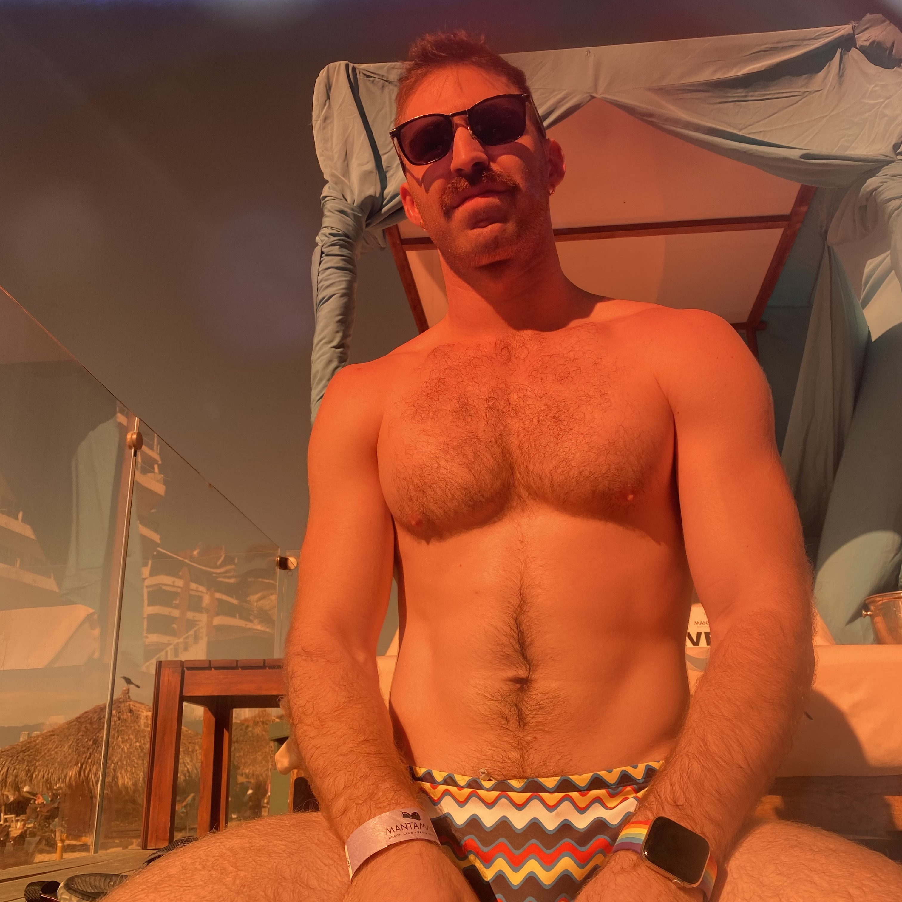

+++
title = "on my life"
date = 2022-03-01T17:55:47-06:00
description = "Does she even go here??"
summary = "How do I stay lean, build muscle, maintain my endurance, and also balance school, publish high-impact research, and play hard every weekend? These are my epiphanies that I hope will answer these questions and let the world understand these pieces of me... ideally maximizing tasteful pride and confidence and minimizing self-aggrandizing narcissism."
categories = ["me"]
toc = true
draft = false
[schema]
  type = "note"
[[copyright]]
  owner = "Zach Stoebner"
  date = "2022"
  license = "cc-by-nd-4.0"
[[resources]]
  src = "image/titties.jpeg"
  name = "thumbnail"
+++

<figure>
 
</figure>
 

**tl;dr** How do I stay lean, build muscle, maintain my endurance, and also balance school, publish high-impact research, and play hard every weekend? These are my epiphanies that I hope will answer these questions and let the world understand these pieces of me... ideally maximizing tasteful pride and confidence and minimizing self-aggrandizing narcissism.

# Life
- I am very, very lucky. 
- I am gay, very sexy, and very smart.
- Under no circumstances will I suffer religious zealotry, homophobia, or bigotry.
- Empathy, kindness, forgiveness, flexibility, and adaptability are more logical and worthwhile than apathy, hate, vindictiveness, rigidity, and immutability.
- I am an experience-oriented person, much less of a results-oriented person.
- <strong>Science, engineering, and math are the most fulfilling and constant themes of my life.</strong>
- My family by birth is important to me. 
- <strong>My physical fitness, diet, and mental health are intertwined and are core to who I am.</strong>

# Lifestyle
- My lifestyle is healthy, yet improvable... and non-negotiable.
- A workout + music / podcast is my critical grounding mechanism, centering meditation, and emotional balancer.
- I don't have to work out every day.
- I like to eat chocolate and all macarons.
- Cutting and bulking cycles are not conducive to my mental well-being. 
	- I like to exercise consistently, maintain my diet, and feel physically healthy all year.
	- Almond milk and plant protein feel better to my body than cow milk and whey protein.  
- Few video games provide real value to my life.
	- But I watch battle royales on Twitch like straight men watch football. 
	- And the lessons and enjoyment gained from the rare role-playing game with a phenomenal story are valuable to me.  

# Corrigenda
- I am relatively terrible at time management.
- I have difficulty focusing, unless I am very excited by the task at hand, even if I want to do it. 
