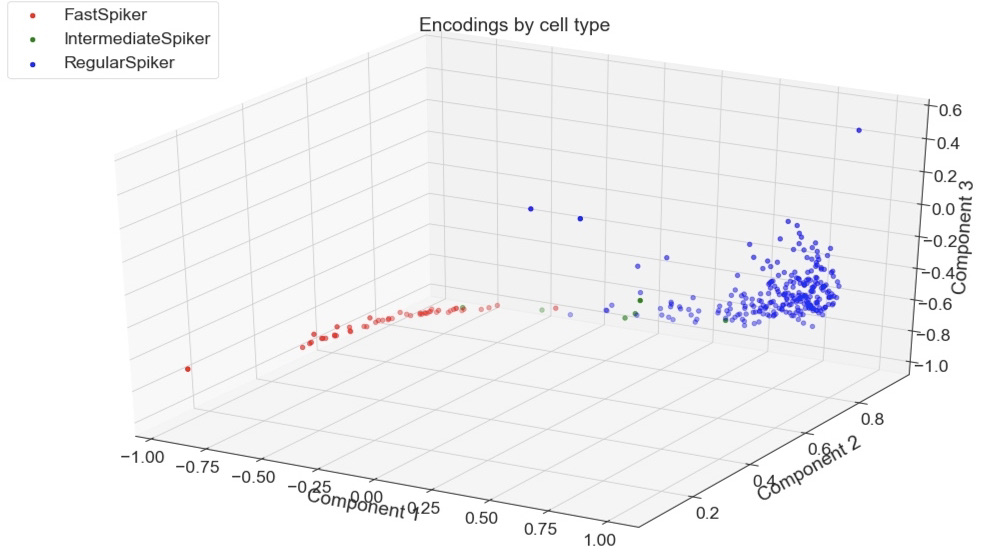
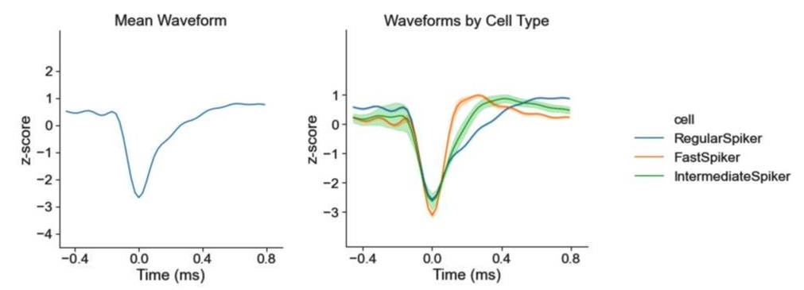
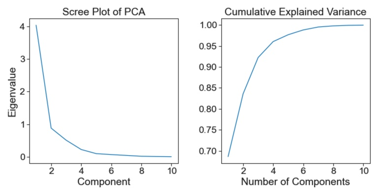
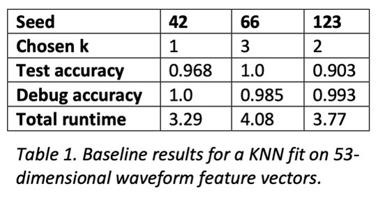
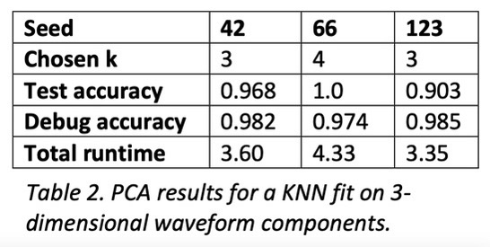
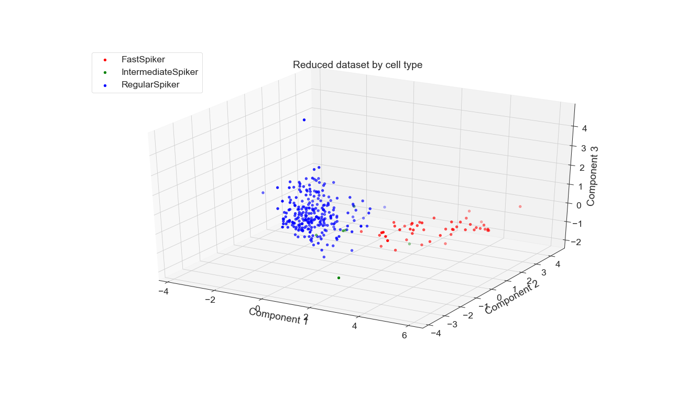
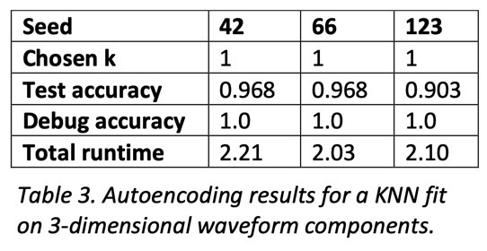
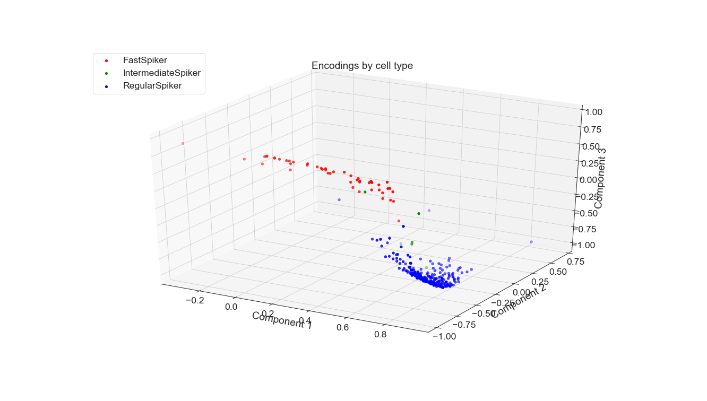
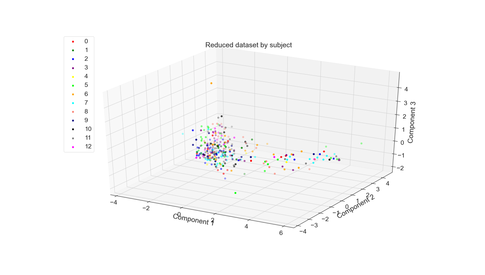

+++
title = "dimensionality reduction on neural data"
date = 2021-06-27T20:58:15-05:00
showmeta = true
categories = ["course", "solo"]
tags = ["neuro", "ml", "python", "stats", "ai", "sigproc"]
description = "PCA vs. autoencoder: the ultimate dimensionality reduction showdown"
summary = "I fell in love with dimensionality reduction when I was learning statistical ML. Since I also study neuroscience, I wanted to practice the art at the intersection of my interests. I compared the 3D projections of a 53-dimensional neurophysiology dataset produced by PCA and a shallow autoencoder."
draft = false
toc = true
[schema]
  type="project"
[[copyright]]
  owner = "Zach Stoebner"
  date = "2021"
  license = "cc-by-nd-4.0"
[[resources]]
  src = "image/header.jpg"
  name = "thumbnail"
+++

<figure>
 
<figcaption>A shallow autoencoder's projection of 53-dimensional vectors to 3 dimensions.</figcaption>
</figure>

**tl;dr** I fell in love with dimensionality reduction when I was learning statistical ML. Since I also study neuroscience, I wanted to practice the art at the intersection of my interests. I compared the 3D projections of a 53-dimensional neurophysiology dataset produced by PCA and a shallow autoencoder. 

# Links 
[repo](https://github.com/zstoebs/neural_dim_reduction)

[report](/doc/cs4262_paper.pdf)

# Motivation
As I began learning about ML and statistical ML in particular, I became fascinated by [dimensionality reduction ](https://machinelearningmastery.com/dimensionality-reduction-for-machine-learning/) (DR) methods. For those that don't know, DRs project data from a high-dimensional space to a low-dimensional space. In essence, they are generalizations of the vector projection methods onto the x-, y-, and z-axes taught in a multivariable calculus course. DR is akin to conventional information compression, trading off size for information loss so choosing the best method and lower dimension is as much art as it is strategy. 

# Content
I used this project to put fingers to keyboard and learn through implementation. I explored two avenues, applying 

1. PCA 
2. An autoencoder

to a waveform-to-cell type classification problem. 

[PCA](https://en.wikipedia.org/wiki/Principal_component_analysis) is the OG DR method. It decomposes the covariance matrix of the dataset to discover components that explain the most variance of the dataset. Then, the dataset is projected onto these components, which often times could . 

[Autoencoders](https://en.wikipedia.org/wiki/Autoencoder) (AEs) are a deep neural network (DNN) that learns to encode examples in a dataset to a lower dimensional latent vector and then decode the latent vector back to the original example. Usually, AEs learn to project examples to a manifold, i.e., they are [non-linear DR methods](https://en.wikipedia.org/wiki/Nonlinear_dimensionality_reduction).  

Essentially, this project compares linear vs. non-linear DR. 

# Method
## Dataset
The [dataset](https://zenodo.org/record/2949959#.X6tuDC9h3RY) and article [Sofroniew, Nicholas James et al. “Neural coding in barrel cortex during whisker-guided locomotion.”](http://elifesciences.org/content/4/e12559v1) can be found on the [author's GitHub repo](https://github.com/sofroniewn/tactile-coding). Of the 16,000 recorded neurons, approx. 30 neurons were recorded for each of 13 subjects. Each recording was comprised of 53 voltage measurements. Overall, the dataset is composed of 302 waveforms. Unavoidably, the dataset is unbalanced; regular spikers comprise 247 of the examples while intermediate spikers only make up 4 examples.

<figure>
 
<figcaption><i>Figure 1. Summary of the waveforms with mean waveform (left) and waveform distributions by cell type (right). Note that the mean waveform is essentially the tightly bounded waveform distribution for regular spikers, which dominate the dataset.</i></figcaption>
</figure>

 

## Classification
To compare and contrast the baseline, PCA, and autoencoding, I implemented a KNN classifier that uses Euclidean distance and majority vote for classification. To find the best number of neighbors given the dataset, I ran it through a standard hyperparameter search using cross-validation and a stratified split of the dataset to mitigate unbalanced classes. Once a good k-value was found, I evaluated the model on the test set, as well as a reclassification of the training set for debugging purposes. 

# Results
The experiments for PCA and autoencoding had the same structure: 1. find the best reduced dimensionality, 2. reduce the dataset, and 3. test with KNN.

<figure>
 
<figcaption><i>Figure 2. Scree plot (left) and cumulative explained variance of the first N components (right) from PCA applied to the waveforms.</i></figcaption>
</figure>

<figure>
 
<figcaption><i>Table 1. Baseline results for a KNN fit on 53-dimensional waveform feature vectors.</i></figcaption>
</figure>

<figure>
 
<figcaption><i>Table 2. PCA results for a KNN fit on 3- dimensional waveform components.</i></figcaption>
</figure>

<figure>
 
<figcaption><i>Figure 3. 3D spatial distribution of the waveform principal components from PCA.</i></figcaption>
</figure>

<figure>
 
<figcaption><i>Table 3. Autoencoding results for a KNN fit on 3-dimensional waveform components.</i></figcaption>
</figure>

<figure>
 
<figcaption><i>Figure 4. 3D spatial distribution of the encodings from the bottleneck layer of the autoencoder.</i></figcaption>
</figure>

For both PCA and autoencoding, the accuracy is only slightly worse than that of the baseline. For PCA, the test accuracy is exactly the same for the 3 seeds while for the autoencoder it is only slightly worse. On the other hand, for the debug accuracy, PCA performs worse than the baseline while the autoencoder performs better. Given that trend, it might suggest that the autoencoder is somewhat overfitting the dataset, diminishing its generalizability. However, the test accuracy suggests that it is not significantly detrimental. All in all, dimensionality reduction still yields data suitable for high performance, even with information loss.

# Future

PCA is a fixed method but AEs are newer and more flexible. A whole study could be done just exploring AE architectures that yield the best projection for this classification task, not to mention other relevant tasks. Of course, other non-DNN non-linear DR methods could be applied to this dataset, which would be particularly interesting for the classification of waveform to subject. Perhaps one of those methods or an AE would be able to adequately separate these classes, which were not easily separable by PCA when I tried.  

<figure>
 
<figcaption><i>Figure 5. 3D spatial distribution of the waveform principal components from PCA for each subject. PCA could not separate these overlapping classes very well,.</i></figcaption>
</figure>

# References

Cunningham, J., Yu, B. Dimensionality reduction for large-scale neural recordings. Nat Neurosci 17, 1500–1509 (2014). https://doi.org/10.1038/nn.3776

Paninski L, Cunningham JP. Neural data science: accelerating the experiment-analysis- theory cycle in large-scale neuroscience. Curr Opin Neurobiol. 2018 Jun;50:232-241. doi: 10.1016/j.conb.2018.04.007. PMID: 29738986.

Wu, Tong et al. “Deep Compressive Autoencoder for Action Potential Compression in Large-Scale Neural Recording.” Journal of Neural Engineering 15.6 (2018): n. pag. Journal of Neural Engineering. Web.

Ladjal, Saïd, Alasdair Newson, and Chi Hieu Pham. “A PCA-like Autoencoder.” arXiv 2 Apr. 2019: n. pag. Print.

[Scree and cumulative explained variance plots](https://jmausolf.github.io/code/pca_in_python/)

[Matplotlib 3D scatter plot](https://stackabuse.com/seaborn-scatter-plot-tutorial-and-examples/)

[Keras autoencoder guide](https://blog.keras.io/building-autoencoders-in-keras.html)

Hyperparameter grid search for Keras:
- https://machinelearningmastery.com/grid-search-hyperparameters-deep-learning-models-python-keras/
- https://stackoverflow.com/questions/49823192/autoencoder-gridsearch-hyperparameter-tuning-keras
- https://towardsdatascience.com/autoencoders-for-the-compression-of-stock-market-data-28e8c1a2da3e
