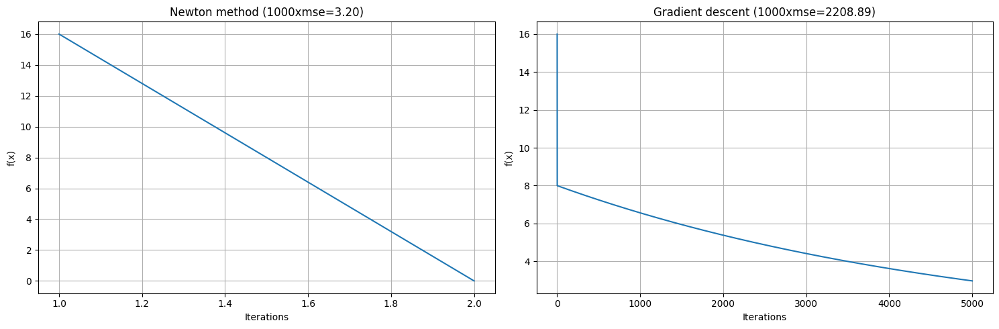
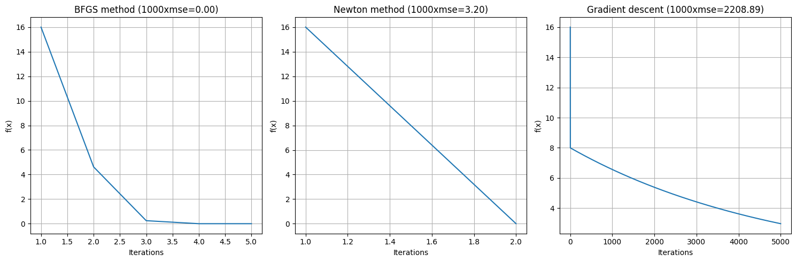
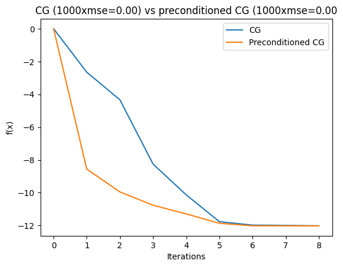

+++
title = "on preconditioning for iterative optimization"
date = 2024-08-03T15:49:00-05:00
showmeta = true
tags = ["ml", "opt", "sigproc", "python"]
description = ""
summary="Preconditioning adjusts the state of a model to {expedite, improve, stabilize} convergence of an optimization procedure, typically by adjusting the gradient in the update rule with the inverse of the Hessian or improving the condition number of a matrix whose spectrum affects convergence."
draft = false
toc = true
[[copyright]]
  owner = "Zach Stoebner"
  date = "2024"
  license = "cc-by-nd-4.0"
+++

Preconditioning adjusts the state of a model to {expedite, improve, stabilize} convergence of an optimization procedure, typically by adjusting the gradient in the update rule with the inverse of the Hessian or improving the condition number of a matrix whose spectrum affects convergence. For the following problems, we are solving $\min_x \frac{1}{2}||Ax-b||_2^2$ for positive definite $A$ where $\kappa (A)$ is large.

## [Newton method](https://en.wikipedia.org/wiki/Newton%27s_method)

This is a root-finding method for a convex function based on its linear approximation (first-order definition of convexity):

A function is convex if $\forall x,y \in D(f)$:

$$
f(y) \leq f(x) + \partial f(x)^T (y-x)
$$

which implies every tangent line of $f$ is below the function. Therefore, if the tangent line intercepts the domain at $y$ then:

$$
\partial f(x) = \frac{f(x) - 0}{x - y} \implies y = x - (\partial f(x))^{-1} f(x)
$$

Rewriting this as an iterative scheme:

$$
x_{n+1} = x_n - (\partial f(x_n))^{-1} f(x_n)
$$

In the context of finding minima with gradient descent (assuming f is twice differentiable), the Newton update is:

$$
x_{n+1} = x_n - (\partial^2 f(x_n))^{-1} \partial f(x_n)
$$

Note that for differentiable scalar-valued functions $f: \mathbb{R}^n \rightarrow \mathbb{R} \implies \partial f(x) = \nabla f(x)$ (the subdifferential equals the gradient) and for vector-valued functions $f: \mathbb{R}^n \rightarrow \mathbb{R}^m \implies \partial f(x) = J_f (x)$ (the subdifferential equals the Jacobian).

<figure>

<figcaption>Figure 1. Convergence of Newton's method vs gradient descent on different plots. Newton's method convergences more quickly and closely to the solution than gradient descent when the problem is poorly conditioned.</figcaption>
</figure>  

 

## [Quasi-Newton method](https://en.wikipedia.org/wiki/Quasi-Newton_method)

For multivariate, high-dimensional regimes, computing the Hessian, Jacobian, etc. can be expensive $\mathcal{O} (mn)$, which implies its an order higher to compute the inverse $\mathcal{O} (n^3)$. Quasi-Newton methods accelerate this procedure with iterative updates to an *approximation* of the inverse Hessian and one of the most renowned is the [BFGS](https://en.wikipedia.org/wiki/Broyden–Fletcher–Goldfarb–Shanno_algorithm) method -- named after Broyden, Fletcher, Goldfarb, and Shanno -- which is implemented in this example.

How do we derive a good approximate of the Hessian?

Similar to Newton's method, we start from the second-order approximation of a convex function:

$$
f(y) \leq f(x) + \partial f(x)^T (y-x) + \frac{1}{2} (y-x)^T B (y-x)
$$

If $y=x_k + \Delta x$ and we take the gradient w.r.t. $\Delta x$, we get the [secant equation](https://en.wikipedia.org/wiki/Secant_method):  

$$
\partial f(x_k + \Delta x) \leq \partial f(x_k) + B \Delta x
$$

If we set it to 0:
$$
\Delta x = -B^{-1} \partial f(x_k)
$$

which implies the Newton step so this is consistent if B is the Hessian.

The [secant equation](https://en.wikipedia.org/wiki/Secant_method) is a line in the function's gradient space that can be used as a condition for each update of the Hessian. How this secant equation is solved is what sets different quasi-Newton methods apart. In BFGS, the quasi-Newton condition is:

$$
B_{k+1} (x_{k+1} - x_k) = \nabla x_{k+1} - \nabla x_k
$$

First, we set $B_0 = \beta I$ where $\beta > 0$ is hyperparameter ensuring that we start with a positive-definite matrix and choose step size $\alpha_k$ with an exact line search adhering to the [Wolfe conditions](https://en.wikipedia.org/wiki/Wolfe_conditions) which are:

$$
\begin{align}
f(x_k + \alpha_k p_k) &\leq f(x_k) + c_1 \alpha_k p_k^T \nabla f(x_k) \\\
p_k^T \nabla f(x_k + \alpha_k p_k) &\geq c_2 p_k^T \nabla f(x_k)  
\end{align}
$$

Then our update rule is:

$$
x_{k+1} = x_k - \alpha_k B^{-1}_k \partial f(x_k)
$$

Using only the known terms in the current update and the gradient at the new iterate $\partial f(x_{k+1})$, we can update the Hessian $B_k$ with [Broyden's method](https://en.wikipedia.org/wiki/Broyden%27s_method) or directly update the inverse Hessian $B_k^{-1}$ with the [Sherman-Morrison formula](https://en.wikipedia.org/wiki/Sherman–Morrison_formula).

The algorithm steps are as follows:

1. Obtain direction $p_k = -B^{-1}_k \nabla f(x_k)$
2. Perform a line search on $\alpha_k$ until the Wolfe conditions on the current iterates are satisfied
3. Set $s_k = \alpha_k p_k$, $x_{k+1} = x_k + s_k$, and $y_k = \nabla f(x_{k+1}) - \nabla f(x_k)$
4. Update inverse Hessian approximation with the SM formula. Let $H_k = B^{-1}_k, \rho = s_K^T y_k$, then:  

$$
H_{k+1} = H_k + \frac{(\rho + y_k^T H_k y_k)(s_k s_k^T)}{\rho^2} - \frac{H_k y_k s_k^T + s_k y_k^T H_k}{\rho}
$$

Note that an approximation of theoretic preconditioners does change the geometry of the problem so the true optimum is technically different. The idea is to ensure an good approximation that makes the change negligible.

<figure>

<figcaption>Figure 2. Convergence of Newton's method vs gradient descent on different plots. Newton's method convergences more quickly to the solution than gradient descent or BFGS but BFGS converges substantially better and faster than gradient descent when the problem is poorly conditioned.</figcaption>
</figure>  

 

## [Conjugate Gradient](https://en.wikipedia.org/wiki/Conjugate_gradient_method#)

Conjugate gradient (CG) minimizes the quadratic:

$$
f(x) = b^T x - \frac{1}{2} x^T A x
$$

where $A$ is positive definite.

Note that the residual norm $||b-Ax||$ is not necessarily monotonically decreasing since $||b-Ax||^2 = x^T A^T A x - 2 b^T Ax + b^T b$ differs from the objective.

If $x \in \mathbb{R}^n$ then CG takes at most $n$ iterations to converge by updating $x_k$ along directions $p_k$ which are conjugate w.r.t. $A$. That is:

$$
x_{k+1} = x_k + \alpha_k p_k
$$

where $p_i^T A p_j = 0$ for $i \neq j$. This implies that $\\{p_1, ..., p_n\\}$ for a basis for $\mathbb{R}^n$ so we can express $ x^* $ as a linear combination of the conjugate directions, i.e., $x^* = \sum_{i=1}^n \alpha_i p_i$ which is equivalent to taking n steps along orthogonal conjugate directions. We can solve for the exact $\alpha_k$ assuming we have access to all $p_k$. However, for large $A$, finding n conjugate directions is intractable.

An important result for iteratively computing $\alpha_k$ and $p_k$ for CG is that the [Krylov sequence](https://en.wikipedia.org/wiki/Krylov_subspace) induced by $A$ implies that $span \\{r_0,...,r_k \\} = span\\{r_0,...,A^k r_0\\} = span\\{p_0,...,p_k\\} \subset span\\{p_0,...,p_k,...,p_n\\}$ where $r_k = \nabla f(x_k) = b - Ax_k$. Therefore, $\alpha_k$ and $p_k$ can be written in terms of the residual $r_k$ at each iteration. Then the update rules are:

$$
\begin{align}
p_0 &= r_0 = b \\\
\alpha_k &= \frac{r_k^T r_k}{p_k^T A p_k} \\\
r_{k+1} &= r_k - \alpha_k A p_k \\\
p_{k+1} &= r_k + \frac{r_{k+1}^T r_{k+1}}{r_k^T r_k} p_k
\end{align}
$$

Take a look at [Boyd's notes on CG](https://see.stanford.edu/materials/lsocoee364b/11-conj_grad_slides.pdf) for more explanation.

### [Preconditioned CG](https://en.wikipedia.org/wiki/Conjugate_gradient_method#The_preconditioned_conjugate_gradient_method)

The convergence of iterative methods depends on the spectral properties of the system matrix $A$. If $A$ is poorly conditioned, then method will take longer to converge. The condition number for any matrix $A$ is defined as:

$$
\begin{align}
\kappa(A) &= ||A|| \\\
||A^{-1}|| &= \frac{\sigma_{max}(A)}{\sigma_{min}(A)}
\end{align}
$$

Therefore, $\kappa(A) \geq 1$ where $\kappa(A) = 1$ is the best conditioning. To precondition CG, we want to find a matrix $M$ s.t. $M^{-1} A \approx 1$ or at least $\kappa(M^{-1} A) < \kappa(A)$.

Designing $M$ depends on $A$. If $A$ is diagonal or diagonally dominant, then a simple [Jacobi preconditioner](https://en.wikipedia.org/wiki/Preconditioner#Jacobi_(or_diagonal)_preconditioner) typically suffices. A more robust method is using incomplete [Cholesky factorization](https://en.wikipedia.org/wiki/Cholesky_decomposition) to tractably design a matrix from lower trianglular matrices that improves the problem's conditioning or using [Chebyshev polynomials](https://en.wikipedia.org/wiki/Chebyshev_polynomials).

With the preconditioner, we want to solve the equivalent system:

$$
\hat{A} \hat{x} = \hat{b} \text{ where } M=LL^T, \hat{A} = L^{-1} A L^{-T}, \hat{x} = L^T x, \hat{b} = L^{-1} b
$$

This results in an extra step of finding $z_k$ s.t. $M z_k = r_k$, which adjusts the updates:

$$
\begin{align}
\alpha_k &= \frac{r_k^T z_k}{p_k^T A p_k} \\\
p_{k+1} &= r_k + \frac{r_{k+1}^T z_{k+1}}{r_k^T z_k} p_k
\end{align}
$$

[Here](https://www.cse.psu.edu/~b58/cse456/lecture20.pdf) are some good notes on preconditioning CG.

<figure>

<figcaption>Figure 3. Convergence of vanilla conjugate gradient vs preconditioned conjugate gradient. Preconditioning leads to iterates that are closer to the solution. For high-dimensional problems where $n$ is very large, preconditioning is necessary to approximate a close-enough solution in a reasonable amount of time.</figcaption>
</figure>

 
