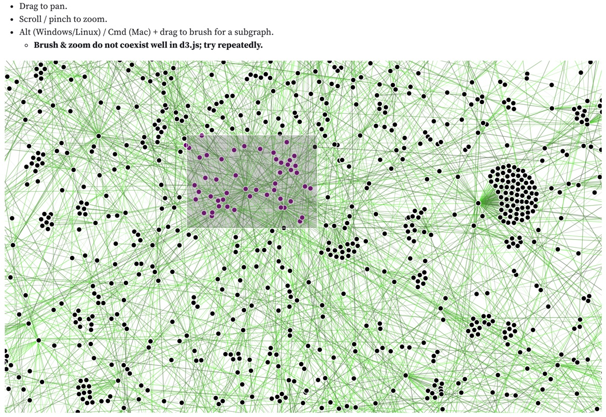
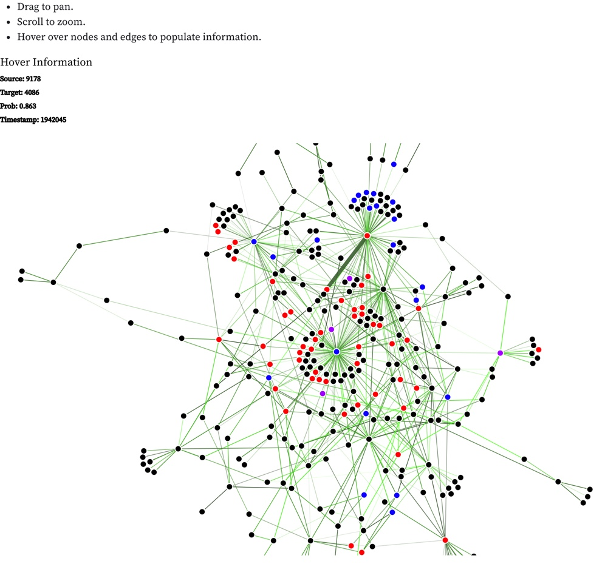
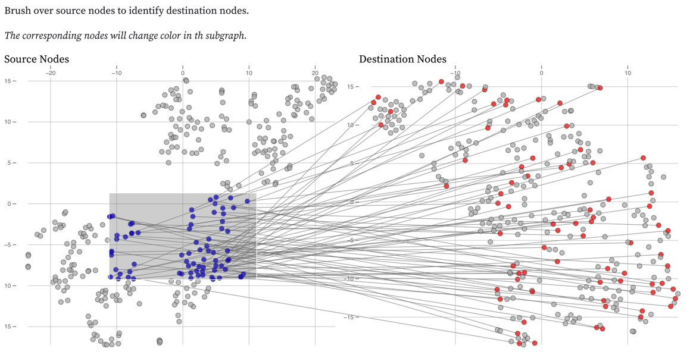

+++
title = "visualizing temporal graph networks"
date = 2021-07-09T13:28:40-05:00
showmeta = true
categories = ["course", "team"]
tags = ["gnn", "ml", "viz", "js", "html", "ai"]
description = "me, 6 months ago: data viz is a dedicated research field??, me, now: thank gawd for data viz researchers..."
summary = "Visualizing the resulting [link prediction graph](https://observablehq.com/@zstoebs/cs-8395-project) from a [temporal graph network](https://arxiv.org/pdf/2006.10637.pdf) on a [Wikipedia dataset](https://snap.stanford.edu/jodie/) using Observable and d3.js."
draft = false
toc = true
[schema]
  type = "project"
[[copyright]]
  owner = "Zach Stoebner"
  date = "2021"
  license = "cc-by-nd-4.0"
  [[resources]]
    src = "image/header.jpg"
    name = "thumbnail"
    title = "graph network"
+++

**tl;dr** Visualizing the resulting [link prediction graph](https://observablehq.com/@zstoebs/cs-8395-project) from a [temporal graph network](https://arxiv.org/pdf/2006.10637.pdf) on a [Wikipedia dataset](https://snap.stanford.edu/jodie/) using Observable and d3.js.

# Usage
1. Clone the repo.
2. `cd viz/`
3. `python server.py`
4. Open the project notebook in Chrome. Safari will likely not work with the server. 

Tips: 
- If the view cells aren't rendered, run the server endpoint cells. 
- It's a big, complex viz so it may take a while to compute the full graph to a point where you can interact with the views. 

# Links
[Observable](https://observablehq.com/@zstoebs/cs-8395-project)

[GitHub](https://github.com/zstoebs/tgn)

# Motivation
It seems like, in the past year, graph neural networks (GNN) have swept through every research circle and someone has spearheaded a journal club presentation about them. Anyways, my friend, Cole, was investigating a new GNN called a temporal graph network (TGN) for his masters thesis. To kill two birds with one stone, he proposed using a TGN for our course project in visual analytics & ML and put into practice this esoteric method that we'd only talked about so far. 

For more background information, visit the Observable notebook linked above. 

# Method
## Preliminaries & Back end: 
To generate the graph using ACCRE, we ran the TGN on the Wikipedia dataset from http://snap.stanford.edu/jodie/ on both the basic link prediction task for the probability data and the node classification task for the context data. To preprocess and arrange the graph, we used NetworkX. To serve the data, we used Flask and, to compute t-SNE, we used SciKit-Learn. All backend code was written in Python and can be cloned from https://github.com/zstoebs/tgn.

## Front end: 
TGNVis currently has 3 main views: a full graph view, a subgraph view, and a subgraph scatterplot view. The full graph view consists of a link-node diagram that displays all of the nodes in the validation set. Each link color is scaled logarithmically based on the timestamp of the link occurring, with brighter and more saturated colors representing later timestamps. Link opacity linearly encodes the probability of the link occurring according to our model, with more opaque links signifying a higher predicted probability. Users can pan and zoom around the full graph view as well as brush when holding the Alt key (Windows / Linux) or Command key (macOS) to select a subset of nodes that will populate the subgraph view and the scatterplot. When nodes are brushed in the full graph, they will change colors from black to purple. Brushing in d3.js does not coexist well with most other interactions so it is inherently bugged; we suggest waiting for the force simulation to settle and trying to repeatedly to brush. 

The subgraph view consists of nodes that have been brushed on the full graph view, plus all of their 1-hop connections. Once the subgraph is populated, hovering over a node or a link will provide the available information about the node or link being displayed. Once again, users can pan and zoom around the subgraph to inspect specific elements. Upon brushing again in the full graph, the subgraph and scatterplots will repopulate. 

The scatterplot view contains the 2-component t-SNE dimensionality reduction view of the context embeddings available for the source and destination nodes of links on the subgraph. In order to retain the most information possible for each link, we provide two subplots that display reduced source and destination embeddings, left to right respectively. We also provide brushing functionality for our scatterplot view on the source node plot. When the plot is brushed, the brushed points will change color to blue, and the corresponding points in the destination scatterplot will also change color to red and lines are drawn to identify the links between selected nodes in the scatterplots. In addition, the subgraph view will update the colors of the selected nodes accordingly with one caveat: if it corresponds to both a source and destination embedding, it will change to purple. Nodes are often involved in multiple link events and therefore have multiple instances in 

# Views
## Full Graph
<figure>
 
<figcaption> Fig 1. The full-graph view displays the full link prediction graph output. It serves as the highest point for analysis. Users can zoom, pan, and brush over a subgraph for closer inspection. </figcaption>
</figure>
 

## Subgraph
<figure>
 
<figcaption> Fig 2. The subgraph view displays the brushed selection from the full-graph view. Hovering over links and nodes populates their information. For nodes, hovering just displays the node's ID whereas hovering over the link populates source and target IDs, predicted probability, and the timestamp. </figcaption>
</figure>
 

## Scatterplot
<figure>
 
<figcaption> Fig 3. The scatterplot view displays the 2-dim t-SNE reduction for all source and target nodes in the subgraph view. The view allows brushing over the source nodes to identify their corresponding target nodes and also highlight the selected source and target nodes accordingly in the subgraph. </figcaption>
</figure>
 

# References
F. Scarselli, M. Gori, A. C. Tsoi, M. Hagenbuchner, and G. Monfardini, “The graph neural network model,” IEEE Trans. Neural Networks, vol. 20, no. 1, pp. 61–80, 2009, doi: 10.1109/TNN.2008.2005605.

W. L. Hamilton, “Inductive Representation Learning on Large Graphs,” no. Nips, pp. 1–19, 2017.

E. Rossi, B. Chamberlain, F. Frasca, D. Eynard, F. Monti, and M. Bronstein, “Temporal Graph Networks for Deep Learning on Dynamic Graphs,” in ICML, 2020, pp. 1–16.

R. Ying, D. Bourgeois, J. You, M. Zitnik, and J. Leskovec, “GNNExplainer: Generating explanations for graph neural networks,” arXiv, no. iii, 2019.

Z. Jin, Y. Wang, Q. Wang, Y. Ming, T. Ma, and H. Qu, “GNNVis : A Visual Analytics Approach for Prediction Error Diagnosis of Graph Neural Networks,” vol. XX, no. Xx, pp. 1–14, 2020.

[Michael Bostock's Temporal Force-Directed Graph](https://observablehq.com/@d3/temporal-force-directed-graph?collection=@d3/d3-force)

[Scax's Force-Directed Graph with Zooming](https://observablehq.com/@scax/force-directed-graph-with-zoom-and-stroke-scaling-svg)
