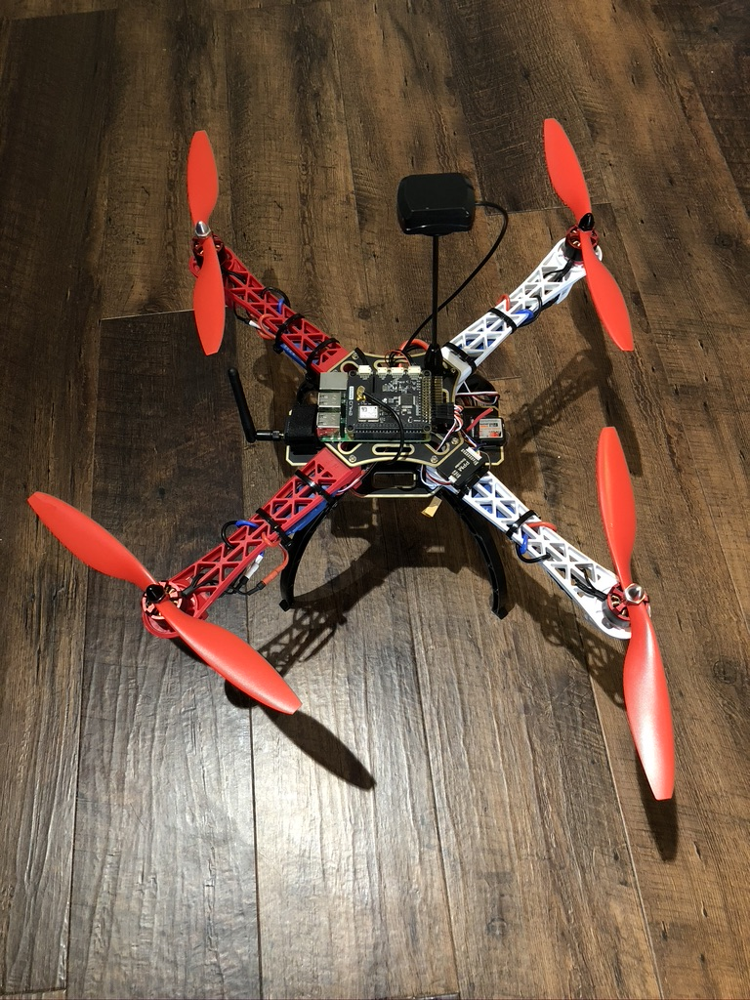

+++
title = "quadcopter build"
date = 2021-07-01T16:57:10-05:00
categories = ["personal"]
tags = ["quads", "cps", "robotics"]
description = "Learning about quadcopters by building one."
summary = "A life-changing introduction to quadcopters and robotics in which I learned a lot about the quad ecosystem and their constitution. However, I suggest following a smaller, cheaper, and recent build guide. Although my naivete showed through here, my fascination with quads has not soured; check out my [Tello face following and vSLAM project](/projects/tello-slam/)!"
draft = false
toc = true
[schema]
  type = "project"
[[copyright]]
  owner = "Zach Stoebner"
  date = "2021"
  license = "cc-by-nd-4.0"
[[resources]]
  src = "image/header.jpeg"
  name = "thumbnail"
+++

<figure>
 
<figcaption>My fully built quadcopter on the ground, not flying... yet.</figcaption>
</figure>

**tl;dr** A life-changing introduction to quadcopters and robotics in which I learned a lot about the quad ecosystem and their constitution. However, I suggest following a smaller, cheaper, and recent build guide. Although my naivete showed through here, my fascination with quads has not soured; check out my [Tello face following and vSLAM project](/projects/tello-slam/)! 

# Motivation
As much as I like software, I also like hardware. I quickly realized that pure computer science wasn't going to expose me to much hardware so I took it upon myself in summer 2020 -- mid-quarantine -- to teach myself. At the time, I was stumbling down a rabbit hole and obsessing over quadcopters, yet I had never laid my hands on one. To me at the time, building a quad from parts was as good a place to start as any. 

# Cost
To make the journey as painless as possible, I followed a build from a $15 Udemy course that was apparently not a moneymaker because it is no longer listed. The build that I followed was not current; the drone industry moves fast and parts will shift in and out of compatibility. You can find potentially better, much cheaper, sufficiently thorough builds on [YouTube](https://www.youtube.com/watch?v=SfFl_-tof4Y). The community is dedicated so up-to-date build guides are very likely. 

If you don't need tools, then this build is approx $500. Again, there are budget drone builds, that are current and probably more satisfying -- don't reinvent the wheel. Or, you could buy a $100 Tello and program the hell out of it. 

## Part List
<i>Disclaimer: some of these parts may no longer be available.</i>

Raspberry Pi: [https://amzn.to/2mrd72g](https://amzn.to/2mrd72g)

NAVIO Kit (Need Power module, wires and GPS): [https://store.emlid.com/product/navio2/?wpam_id=3](https://store.emlid.com/product/navio2/?wpam_id=3)

ESCs 4 PACK: [https://amzn.to/2kTweBt](https://amzn.to/2kTweBt)

Motors 4 PACK: [https://amzn.to/2ltKilA](https://amzn.to/2ltKilA)

RC Controller: [https://amzn.to/2n05Zdq](https://amzn.to/2n05Zdq)

Frame: [https://amzn.to/2mSmNCW](https://amzn.to/2mSmNCW)

Props: [https://amzn.to/2my3w9C](https://amzn.to/2my3w9C)

Battery: [https://amzn.to/2kSlzHe](https://amzn.to/2kSlzHe)

Battery Charger: [https://amzn.to/2kXA1hi](https://amzn.to/2kXA1hi)

Telemetry: [https://amzn.to/2myfH6l](https://amzn.to/2myfH6l)

LiPo Fire-proof Case: [https://amzn.to/2lsRu1i](https://amzn.to/2lsRu1i)

PPM Encoder: [https://amzn.to/2n1hjWR](https://amzn.to/2n1hjWR)

Micro SD Card: [https://amzn.to/2lvcJiS](https://amzn.to/2lvcJiS)

Micro SD to USB: [https://amzn.to/2n09yQQ](https://amzn.to/2n09yQQ)

Battery Connector: [https://amzn.to/2ltOP7A](https://amzn.to/2ltOP7A) or [https://amzn.to/2n0a3KI](https://amzn.to/2n0a3KI)

GPS Mount: [https://amzn.to/2luGOiz](https://amzn.to/2luGOiz)

Velcro Straps: [https://amzn.to/2lsloTe](https://amzn.to/2lsloTe)

Scotch Mounting Tape: [https://amzn.to/2mSsdxM](https://amzn.to/2mSsdxM)

Zip Ties: [https://amzn.to/2lveUTA](https://amzn.to/2lveUTA)

**Additional tools if needed**: 

Soldering Iron Kit: https://amzn.to/2kZklKw

Helping Hands: https://amzn.to/2lvfxwq

Allen Wrench: https://amzn.to/2mVFfus

Electrical Tape: https://amzn.to/2ls4Niv

Spacer Kit: https://amzn.to/2NTIyeY

Drill and Drill Bits: https://amzn.to/2SQrZBK

# Lessons
Building a drone is easy, getting it to fly is hard. Soldering, plugging, and fixing hardware to the frame is like legos. Flashing the flight OS onto the Raspberry Pi + Navio2 flight controller is no problem. Finding a functioning ground control software from this century = yikes. Then you just have to pray that it's compatible with your flight controller. 

On a side note, this drone is deceptively big. Although I'm not an expert aerospace engineer, I deduce that getting big things to fly is much more of a hassle than for small things, especially if you live in an apartment in the city.

One super fun takeaway: learning how components connect to the whole quad, how they communicate with each other, and how a full-fledged cyberphysical system can come together was extremely rewarding. 

**Large quad with exposed wires and point ends = the ultimate cat chew-toy**

# Future
Off and on, I may try to get this quad flying. However, it will likely remain a trophy of my first foray into quads, and also a testament to my initial learning curve. As I've hinted at many times, I soon intend to follow a smaller, cheaper build. Most importantly, I'm excited to take what I learned here and apply it broadly to other hardware projects. 

# References
- [Caleb Bergquist](https://dojofordrones.com/author/caleberg/), instructor of the long lost Udemy course
- [Joshua Bardwell](https://www.youtube.com/channel/UCX3eufnI7A2I7IkKHZn8KSQ)
- [https://ardupilot.org/copter/docs/common-navio2-overview.html](https://ardupilot.org/copter/docs/common-navio2-overview.html)
