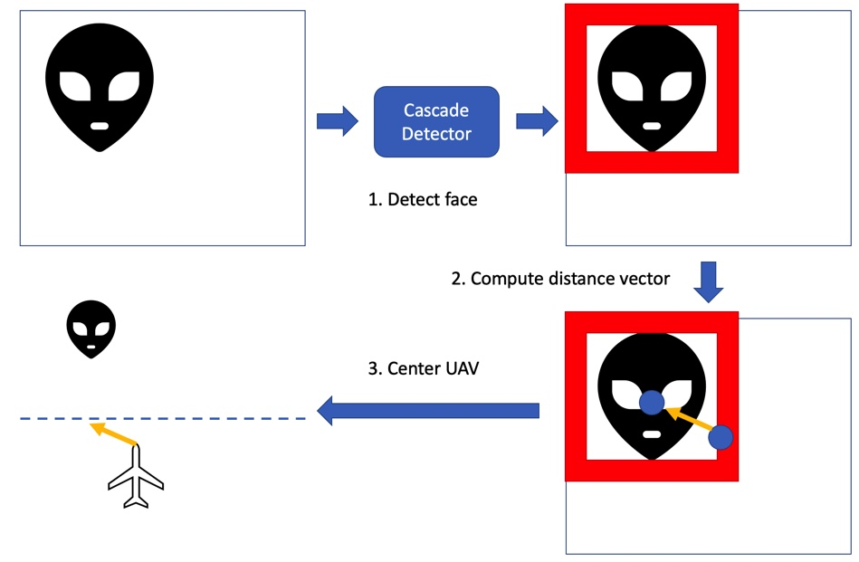
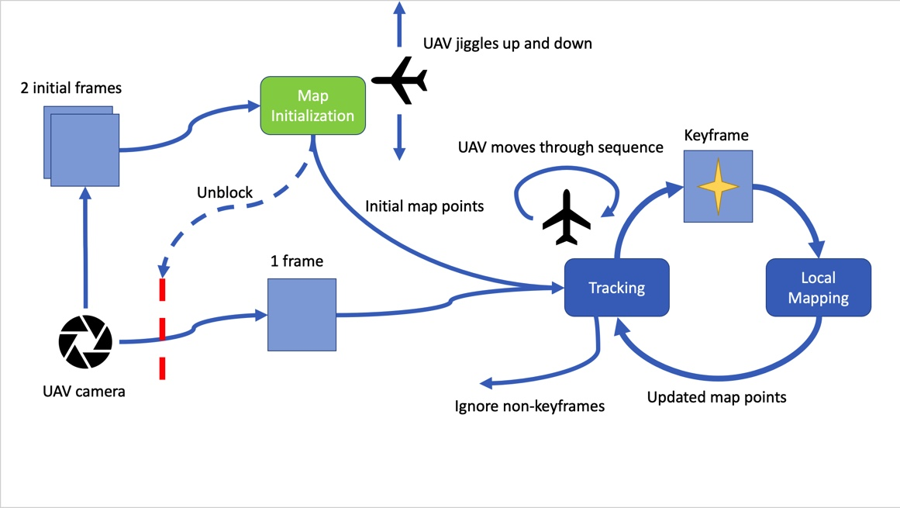
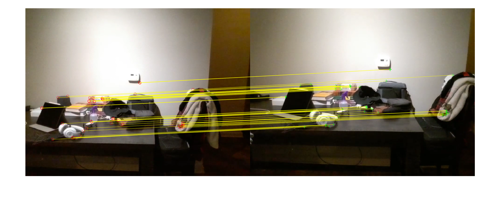

+++
title = "face following and vSLAM for a Tello quadcopter"
date = 2021-07-02T11:46:28-05:00
categories = ["course"]
tags = ["quads", "robotics", "cps", "ml"]
description = "Tello can do hard things."
summary = "Implementation of face detection / following and vSLAM on a [Ryze Tello](https://www.ryzerobotics.com/tello) using its [MATLAB toolkit](https://www.mathworks.com/hardware-support/tello-drone-matlab.html)."
draft = false
toc = true
[schema]
  type="project"
[[copyright]]
  owner = "Zach Stoebner"
  date = "2021"
  license = "cc-by-nd-4.0"
[[resources]]
  src = "image/header.jpg"
  name = "thumbnail"
  title = "vSLAM schematic"
+++

**tl;dr** Implementation of face detection / following and vSLAM on a [Ryze Tello](https://www.ryzerobotics.com/tello) using its [MATLAB toolkit](https://www.mathworks.com/hardware-support/tello-drone-matlab.html).

# Links
[GitHub](https://github.com/zstoebs/tello_detection_SLAM)

[Paper](/doc/eece6356_paper.pdf)

# Motivation
Following my [quad build](https://zstoebs.github.io/projects/quad-build/) experience, I set the intention of continuing to work with and learn more about quads. Whereas in that project I focused more on the hardware side of quads, I wanted to focus more on the software side in this one. Specifically, I wanted to program a quad with autonomous functionality. While working on the quad build, I stumbled upon face detection & following and SLAM. Face detection & following is straightforward: use deep learning to draw a bounding box around faces in the image and compute the direction to travel based on the size and offset from the image's center. vSLAM on the other hand is more interesting in my opinion. For those that don't know: [simultaneous localization & mapping](https://en.wikipedia.org/wiki/Simultaneous_localization_and_mapping) (SLAM) uses sensor data, i.e., lidar, radar, camera, etc., to create a map and track the location(s) of the agent(s) on the map. This problem is intractable and elegantly implementing it in the field is a unique challenge, often requiring a team with intimate knowledge of the UAV to tailor clever SLAM algorithms to it. 

# Contents
- main.m: control flow script to demonstrate each of these on the Tello. 
- follow.m: face detection and following algorithm that returns the movement vector required to center the drone on the detected face, if there is one. 
- vslam.m: implements vSLAM using the drone's pinhole camera given a predetermined movement sequence that should be cycled a handful of times. 

# Method
## Face Following
Algorithm:
1. Pass the frame to the object detector and retrieve a bounding box location(s) for the detected object.
2. Draw boxes around all of the detected images.
3. Use the closest bounding box’s width and center coordinates to compute the relative axis change as a percentage of the max.
4. Based on some threshold percentage and some minimum movement distance, set the axes distances and return them to be used in a move command.

<figure>
 
<figcaption> Fig 1. Face following schematic. An image is passed to the cascade object detector. The detector draws a bounding box around the face. The centering vector from the current center to the center of the bounding box is computed. The UAV moves in the direction of the centering vector while maintaining a safe, specified distance.</figcaption>
</figure>

 

## vSLAM
This vSLAM implementation breaks down into three key parts: map initialization, tracking and local mapping. 

Starting with map initialization, the steps are as follows:
1. Track the ORB features on the first image to load the pre-points, then track a second image.
2. Match the ORB feature correspondences between the two images.
3. If enough matches are made (100), compute the homography and fundamental matrices so that the correct geometric transform is applied based on which results in the least error for the relative camera pose.
4. If insufficient matches are made, then the loop restarts on a new image. Manually, the loop has a maximum of 5 iterations to find a matched image until an error is thrown. If a match is not made in 5 iterations, it may imply that the Tello has weak connection and low light and needs to be reset.
5. Triangulate the 3D locations of the matched features in the new map.

For tracking: 
1. Move the drone according to the modulus of the current move index by the length of the move sequence.
2. If the Tello loses connection and throws an error, loop back to see if connection is regained, changing no indices except a break iteration countdown of 10. Throw the error if the break countdown expires.
3. Extract ORB features from the frame and match with the latest keyframe. If the new frame is not a keyframe, continue the loop.
4. Estimate the camera pose with Perspective-n-Point [10] in order to project the features to the current frames perspective and correct using some bundle adjustments[8]. This step, although esoteric, is important for the fast computation of that ORB-SLAM offers compared to the competition.
5. Determine if the current frame is a key frame given the criteria. If so, the process continues to local mapping. Else, the loop iterates, and the above steps are redone for the next frame. Additionally, this step also speeds up the process; instead of evaluating all of the features in every frame for mapping, only a select few that are substantially different are filtered for usage.

The local mapping steps are as follows:
1. Add the new keyframe to the set.
2. Compare the keyframes features against all the other keyframe features, looking for unmatched points that occur in at least 3 other keyframes.
3. Bundle adjust the pose based on the adjacent keyframes’ poses.

<figure>
 
<figcaption>Fig 2. Visual ORB-SLAM schematic. The process starts by initializing the map with two initial frames from the camera. During the initialization the UAV jiggles up and down to snapshot slightly different pairs of images with different feature extractions but still with some matches. If the map initializes, then the program proceeds to the main loop where it first tracks the features on a new frame. If the frame is a keyframe, then the new features are updated into the map. If the frame is not a keyframe, then the loop continues. At the start of each loop iteration, the UAV executes the next move in the sequence.</figcaption>
</figure>

# Results
## Face Following
<figure>
 
<figcaption> Fig 3. Examples of when my face is detected. Looking at the Tello (left) and not looking at the Tello (right). Nonetheless, it still detects my face and doesn’t pick up much noise, even in low light. </figcaption>
</figure>
 

<figure>
 
<figcaption> Fig 4. Example of face misclassification. These misclassifications typically occur when there is no face in view of the camera. Otherwise, they are rare and not noticeable during a face following run. </figcaption>
</figure>
 

Face following was easy to implement. The ony hindrance was the occasional misclassification confusing the Tello, causing it to align with that "face". You can see from these face detection frames that a bounding box computed. From here, the distance to the target can be inferred from the area of the bounding box and the alignment offset can be inferred from the bounding box center's distance from the frame's center. 

## vSLAM

<figure>
 
<figcaption> Fig 5. Example of a map initialization feature match. Typically, the map initialized and I could get a sense of where the features were. </figcaption>
</figure>
 

<figure>
 
<figcaption> Fig 6. Examples of good (left) and average (right) feature extraction. Often times, the good initial feature extractions really set the momentum for how the rest of the main loop would turn out. Notice that the busier nearby area with more edges acquires more features. </figcaption>
</figure>
 

<figure>
 
<figcaption> Fig 7. Examples of map plots and estimated trajectories and camera pose. Both of the movement sequences were left and right images and that the number on the camera indicates that there were 10 keyframes in this vSLAM run.</figcaption>
</figure>
 

vSLAM was a much harder task to get right. One crux of the system was the speed at which the Tello captured frames; for vSLAM to work well, frames need to be captured in quick succession, with very slight movements. Precisely moving the Tello proved to be very challenging with the MATLAB toolkit, plus an indoor environment where the Tello's own gusts from its propellers reflected off of hard surfaces would significantly alter its course. Regardless, the system was still able to generate a point cloud and update location within the map.  

# Future
1. Streamline main.m with user input to guide the program and improve the functionality of vslam.m as best I can for Tello. 
2. Implement general object detection alongside the face detection pipeline. 
3. Add autonomous movement based on point cloud --> remove need for a predetermined path. 
4. The implementations here are stepping stones to some more intelligent autonomous UAV behavior. I have the idea that I'll implemennt path planning on a Tello as well. Once I have that, I may integrate these three features into a Tello hide-n-seek project.

# References
## Papers

P. Viola and M. Jones, “Rapid Object Detection using a Boosted Cascade of Simple Features,” 2001 Comput. Vis. Pattern Recognit., 2001.

E. Rublee, V. Rabaud, K. Konolige, and G. Bradski, “ORB: An efficient alternative to SIFT or SURF,” Proc. IEEE Int. Conf. Comput. Vis., pp. 2564–2571, 2011, doi: 10.1109/ICCV.2011.6126544.

C. Cadena et al., “Past, present, and future of
simultaneous localization and mapping: Toward the robust-perception age,” IEEE Trans. Robot., vol. 32, no. 6, pp. 1309–1332, 2016, doi: 10.1109/TRO.2016.2624754.

R. Mur-Artal, J. M. M. Montiel, and J. D. Tardos, “ORB-SLAM: A Versatile and Accurate Monocular SLAM System,” IEEE Trans. Robot., vol. 31, no. 5, pp. 1147–1163, 2015, doi: 10.1109/TRO.2015.2463671.

B. Williams and I. Reid, “On combining visual SLAM and visual odometry,” Proc. - IEEE Int. Conf. Robot. Autom., pp. 3494–3500, 2010, doi: 10.1109/ROBOT.2010.5509248.

## Code 
- The vslam.m code is modified from the [vSLAM Matlab example](https://www.mathworks.com/help/vision/ug/monocular-visual-simultaneous-localization-and-mapping.html).

References from my first exposure to quad programming and face detection:
- [TelloTV](https://github.com/Jabrils/TelloTV)
- [TelloPython](https://github.com/dji-sdk/Tello-Python)
