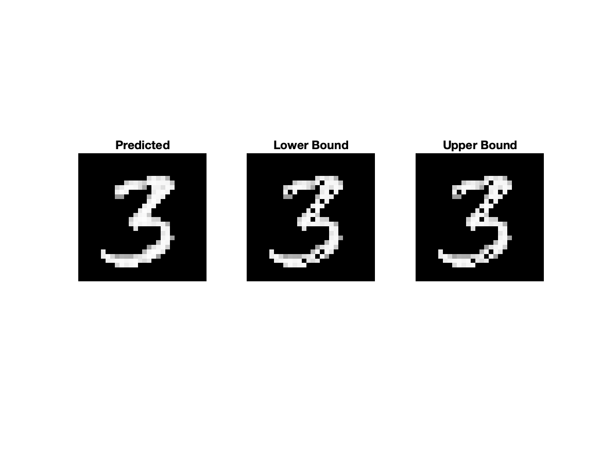
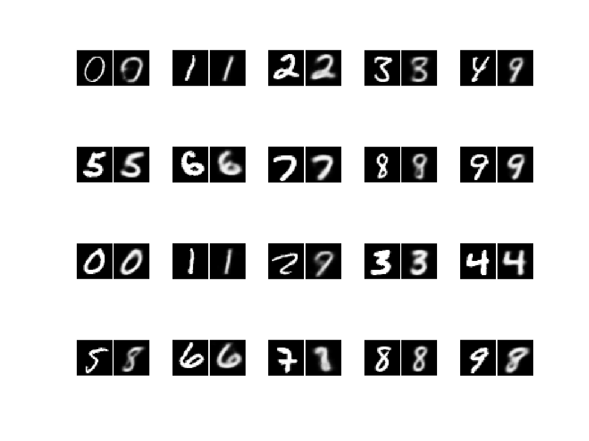
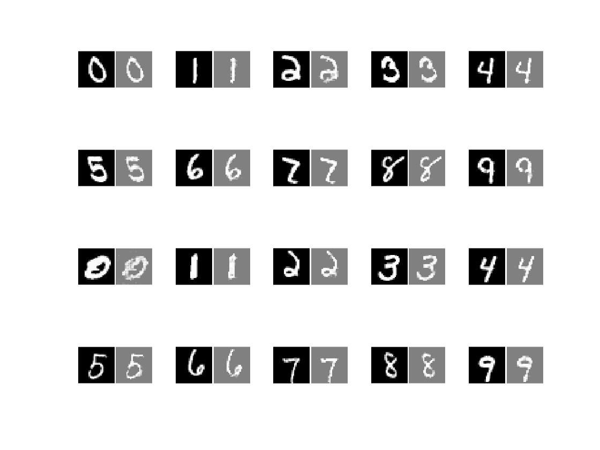
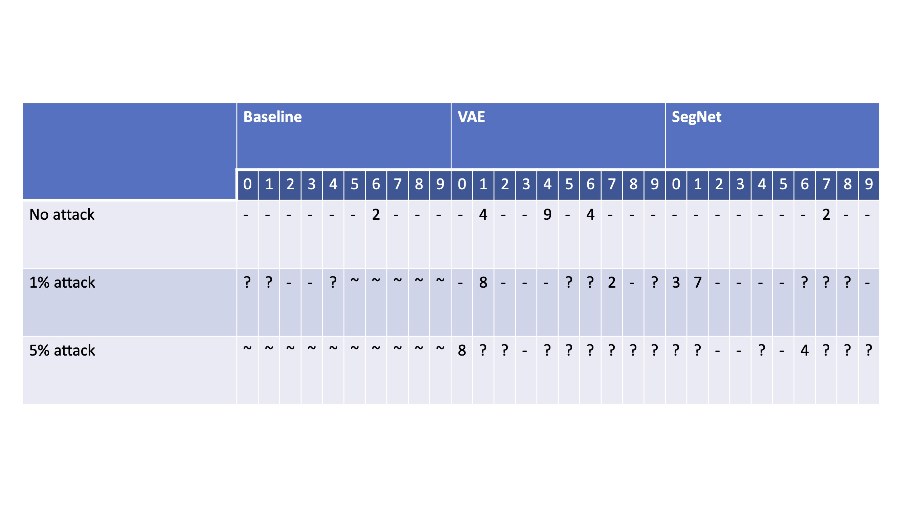
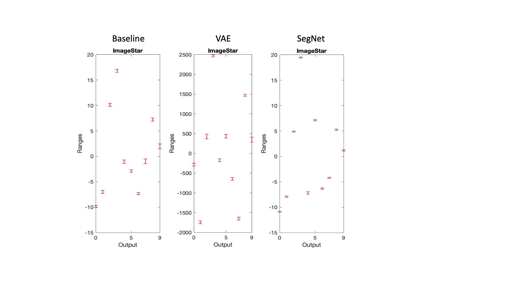

+++
title = "verification of a VAE & SegNet using NNV"
date = 2021-07-09T13:51:01-05:00
categories = ["course"]
tags = ["ml", "cps", "matlab"]
description = "''Many things that seem threatening in the dark become welcoming when we shine light on them.'' -- Uncle Iroh. M|ang|e|kyo sha|ri|nga|n <Ø>"
summary = "Neural network automated verification of a VAE and SegNet using NNV. Although neural networks are promising, they are easily confused, particularly if the input domain is perturbed. In this project, I demonstrate the robustness of MNIST-trained VAE and SegNet against varying brightness attacks."
draft = false
toc = true
[schema]
  type = "project"
[[copyright]]
  owner = "Zach Stoebner"
  date = "2021"
  license = "cc-by-nd-4.0"
[[resources]]
  src = "image/header.png"
  name = "thumbnail"
+++

<figure>
 
<figcaption>Lower bound and upper bound attacks on a generated image from a VAE.</figcaption>
</figure>

**tl;dr** Neural network automated verification of a VAE and SegNet using NNV. Although neural networks are promising, they are easily confused, particularly if the input domain is perturbed. In this project, I demonstrate the robustness of MNIST-trained VAE and SegNet against varying brightness attacks.

# Links
[Github](https://github.com/zstoebs/vae_segnet_verification)

[Paper](/doc/stoebner_cs6315_report.pdf)

# Motivation
After many face palms and harrowing all-nighters, I learned that achieving reliable performance, for even a task as simple-sounding as face following, is a true feat worthy of ascension from padawan to knight. Even though teams of engineers can concoct relatively high-performing models, I've learned from first-hand experience, as many others have, that even at the highest level ML messes up... a lot. 

For computer vision in particular, neural networks [NNs] tend to mess up when images are perturbed in some way, e.g., a brightness attack or a deformation, which may be imperceptible to the human eye. Read about [optical adversarial attacks against road sign classifiers](https://www.unite.ai/optical-adversarial-attack-can-change-the-meaning-of-road-signs/) and [defeating deepfake detectors](https://www.sciencedaily.com/releases/2021/02/210208161927.htm). Subtle intensity differences between images frequently confounds analysis in image-based learning and applications; for example, I also research methods for  harmonization of longitudinal MRI datasets using GANs to correct these minute differences. As I was learning about formal methods and automated verification, I wondered whether NNs can be verified for robustness against attacks and, in turn, also verify the performance of generator networks, such as autoencoders, in generating utile images. As a learning experience, this exploratory project is a classic case of "know thy enemy".

# Content
- train_segnet.m: trains a SegNet on MNIST
- train_VAE.m: trains a VAE on MNIST
- verify_segnet.m: attempts verification of SegNet given perturbed or unperturbed input
- verify_VAE.m: attempts verification of VAE given perturbed or unperturbed input

Other files are ported or modified from [MATLAB's VAE demo](https://www.mathworks.com/help/deeplearning/ug/train-a-variational-autoencoder-vae-to-generate-images.html). 

# Method
<i>For a light background on some of the set theory behind neural network verification and why this task is particularly challenging, please refer to the report linked at the top of this page.</i>

For the first part of the project, I trained a VAE and SegNet, both with the [ELBO loss function](https://arxiv.org/pdf/1711.00464.pdf), on MNIST. Figures 1 and 2 display real and fake images for each network; the VAE tended to blur the image whereas the SegNet learned the structures suspiciously well, potentially a result of overfitting. 

<figure>
 
<figcaption><i>Figure 1. Examples of real inputs (left) and fake outputs (right) for the VAE. The pairs demonstrate examples where the VAE performs well and where it does not, noticeably a ‘9’ that becomes an ‘8’ and a ‘4’ that becomes a ‘9’.</i>
</figcaption>
</figure>

<figure>
 
<figcaption><i>Figure 2. Examples of real inputs (left) and fake outputs (right) for the SegNet autoencoder. Compared to the VAE, the SegNet is less confused about the structure of the input images. However, the two channel output results in an average of the binary masks which gives a gray image.</i>
</figcaption>
</figure>

After training the generator networks, I parsed them into NNV format and appended an MNIST classifier to each of them. In a tutorial, NNV constructed a simple CNN MNIST classifier that performed exceedingly well so I ported that model into this project. 

To verify robustness of the generator + classifier, the top 1% or 5% of pixels in input images were eliminated, where the lower bound zeroed out the original intensity while the upper bound kept 5% of the original intensity. From here, NNV constructs polytope set representations of the input domain to feed to the NNV representations of the networks, in order to approximate the entirety of the output domain as a zonotope, star, and abstract polytope reach set. 

In terms of analysis, NNV plots error bars, denoting the upper and lower bound probabilities that a given example belongs to each class, for each reach set. A network is robust for a certain class, for a certain set, if the lower bound for the class is greater than the upper bound for all other classes, given an approximated reach set. 

# Results
The approximated zonotope reach set was inconclusive for both models at each level of attack whereas ImageStar and abstract polytope sets had almost identical results and differentiated model performance; therefore, these two reach sets were used in subsequent analyses. For the baseline, the output domains became too varied with greater levels of attack that were not reasonably computable on a CPU so no data was gathered for classes at those levels of attack for the baseline. Table 1 contains a summary of the results for each class for MNIST (baseline) and generated VAE & SegNet images. Both models were particularly robust to the digit 3; the star set results are displayed for this class are displayed in Figure 3.

<figure>
 
<figcaption><i>Table 1. Summary of results per class for baseline, VAE, and SegNet images passed to the classifier. - = robust; {0,1,2,3,4,5,6,7,8,9} = not robust, misclassified to digit; ? = not robust, uncertain, overlapping ranges; ~ = no data.</i></figcaption>
</figure>

<figure>
 
<figcaption><i>Figure 3. Error bars for the digit ‘3’ for each method for the ImageStar set for the 1% attack. The classifier was distinctly robust to this class for the three types of images, for both attacks. Compared to other classes, the error bars for the ‘3’ class are very narrow for an attacked image.</i></figcaption>
</figure>

# Future
This field of NN verification is extremely new and methods for verifying networks with activations other than ReLU and sigmoid are not well-defined. I learned about the field of neural network verification from this project and at the time of writing I am satisfied by what I've learned. Extending the project, formulating a procedure for verifying generator network outputs with automated NN verification would be a useful tool for many an ML practicioner. A procedure with the current SOTA using my generator + classifier setup might be feasible; however, I expect that we will have to wait for the field to progress significantly further. 

# References
X. Huang et al., “A Survey of Safety and Trustworthiness of Deep Neural Networks: Verification, Testing, Adversarial Attack and Defence, and Interpretability ∗,” arXiv, pp. 0–94, 2018.

C. Liu, T. Arnon, C. Lazarus, C. Barrett, and M. J. Kochenderfer, “Algorithms for verifying deep neural networks,” arXiv, pp. 1–126, 2019, doi: 10.1561/2400000035.

K. Simonyan and A. Zisserman, “Very deep convolutional networks for large-scale image recognition,” 3rd Int. Conf. Learn. Represent. ICLR 2015 - Conf. Track Proc., pp. 1–14, 2015.

H. D. Tran et al., “NNV: The Neural Network Verification Tool for Deep Neural Networks and Learning-Enabled Cyber-Physical Systems,” Lect. Notes Comput. Sci. (including Subser. Lect. Notes Artif. Intell. Lect. Notes Bioinformatics), vol. 12224 LNCS, pp. 3–17, 2020, doi: 10.1007/978-3- 030-53288-8_1.

Y. Lecun, L. Bottou, Y. Bengio, and P. Ha, “LeNet,” Proc. IEEE, no. November, pp. 1–46, 1998.

D. P. Kingma and M. Welling, “Auto-encoding variational bayes,” 2nd Int. Conf. Learn. Represent. ICLR 2014 - Conf. Track Proc., no. Ml, pp. 1–14, 2014.

V. Badrinarayanan, A. Kendall, and R. Cipolla, “SegNet: A Deep Convolutional Encoder-Decoder Architecture for Image Segmentation,” IEEE Trans. Pattern Anal. Mach. Intell., vol. 39, no. 12, pp. 2481–2495, 2017, doi: 10.1109/TPAMI.2016.2644615.

A. A. Alemi, B. Poole, I. Fische, J. V. Dillon, R. A. Saurous, and K. Murphy, “Fixing a broken elbo,” 35th Int. Conf. Mach. Learn. ICML 2018, vol. 1, pp. 245–265, 2018.

H. D. Tran et al., “Star-based reachability analysis of deep neural networks,” Lect. Notes Comput. Sci. (including Subser. Lect. Notes Artif. Intell. Lect. Notes Bioinformatics), vol. 11800 LNCS, pp. 670–686, 2019, doi: 10.1007/978-3-030-30942-8_39.
